# ParaEGOX 当前阶段开发执行看板

> 状态：Current（本地执行视图，不进入 Git）
> 更新日期：2026-08-09
> 当前最新 T2-B 证据：r158 `0bcc49d03d15cca720021868a08d37912f62128a` 已完成 asymmetric remote-Agent Fabric profile 与 Linux 真实网络 ACL 验证；这是传输基座，不是 Runtime activation 或双机 Mac process 证明
> 历史 S7 提交基线：`4334a59`（已推送；S7-F bounded Controller reconciliation 已提交；Ubuntu CI `30787514013` 的 Rust job 成功，governance/tests job 因跨 service-account Python probe 使用 uv interpreter 路径而有 3 个 Runtime socket readiness 失败；后续工作树已有 `/usr/bin/python3` probe 修正）
> 当前最新已验证公开 Deployment ref：r130 `92923eef016e6ce060c32113ad3cf5e59ee8520c`（Ubuntu workspace fmt、Local/workspace all-target check 与 warnings-denied Clippy、non-root Local 138/138、non-root Deployment 393/393、workspace all-target executable `--no-run` 均通过；`--no-run` 不代表完整 workspace tests 已执行）
> 运行证据：r130 T1 public process smoke 1/1 通过；全部 ParaEGOX process 在单 Ubuntu 主机、同一 `nobody` UID/GID、真实 non-loopback mTLS 下完成 schema-v3 Node/PXEA-v2 fresh、隔离 wrong-SHA negative、schema-v2 Deployment Fabric→Agent→descriptor Fresh Ready/SIGTERM 0、Node+Deployment same-state Resume Ready/SIGTERM 0，以及独立 Node-down negative。pytest parent stack 为默认 8192 KiB，harness 仍设置 16 MiB `RUST_MIN_STACK`，production 使用具名 16 MiB Deployment executor。该证据不是 Agent access/session/Echo、双主机、provider mismatch、Authority failure、remote TUI 或 reconnect 证据
> expiry 证据：r84 `74e349aa2d117da416f816a840f0fe79768b4a7a` 同一 binary 等待真实 60 秒 deadline 后，PXND 从 `next3/visible1/replay1/validity1` 收敛为 `next4/visible0/replay0/validity0`，Node Ready/SIGTERM 0，随后 Node+Deployment Resume Ready/SIGTERM 0；r85 只加 fence tests，r86 只加治理/harness 登记，production Rust 未变
> 历史 G2 code-and-governance 证据：r51 `b1d1206d2187b85d335ae352c226274d8e9d5827` 通过 workspace format、完整 governance checker、workspace check/Clippy、non-root Local 111/111、all-target test executable `--no-run` 与 doctest；完整 workspace test suite 未在该组结果中执行。r85 的 Deployment 387/387 已由 r130 的 393/393 successor evidence 取代
> 架构权威：[Kernel Foundation 实施计划](kernel-foundation.md)
> 范围：从已完成的 B1 apply-control spine 推进到可认证、可限时，再到单 Node、可运行且有界的 P2 Runtime/Deployment 基础闭环

## 0T2-B. 2026-08-09 asymmetric remote-Agent Fabric profiles（r158 已验证）

### 已实现边界

- 精确 ref：`0bcc49d03d15cca720021868a08d37912f62128a`。
- [`FabricService`](../../crates/paraegox-fabric/src/service.rs) 仍由一个实例独占一个私有 Zenoh 1.9 `Session`，没有拆出第二条 Fabric session。
- Ubuntu listener profile：保留 T1 loopback listener，增加一个 non-loopback TLS listener，connector 为空。
- 名义 Mac connector profile：listener 为空，只有一个 TLS connect endpoint；当前尚无真实 Mac composition 将其装配进进程。
- 两种 profile 均采用 default-deny ACL，以对端证书的精确 CN 为 subject，只允许 remote-Agent submit/control 两条精确 key expression 及所需 query/reply/queryable 方向。
- `**` wildcard route 由严格 constructor 拒绝；ACL 中没有 put/subscriber allow rule。
- same-session 的本地 T1 self-query 继续可用；独立 plaintext loopback Session 属于 transport 流量并被 ACL 拒绝。

### Ubuntu 证据

- 完整 `paraegox-fabric` suite：50/50 通过。
- format 与 Clippy：通过。
- [`remote_agent_mtls.rs`](../../crates/paraegox-fabric/tests/remote_agent_mtls.rs) 真实 non-loopback 网络 case：7.05 秒完成。
- 正确 CN：submit/control 两条精确 route 均成功。
- 正确 CN 的越界访问：sentinel、parent、child route 全部拒绝，服务端回调计数保持为零。
- 同 CA 错误 CN：可以完成 TLS/session 建立，但 submit/control 均被 ACL 拒绝。
- 同一服务 Session：既有 T1 本地 submit/control 仍成功。
- 独立 plaintext loopback peer：submit/control 均拒绝。
- shutdown：client/server handler 收敛，loopback 与 remote 端口均可重新绑定。
- `**` 仅由 strict constructor/static test 在 Session open 前拒绝，不属于真实网络矩阵。
- put/subscriber 仅有“ACL 配置不存在 allow rule”的静态证据，真实网络测试未实跑这两类操作。

### 拦截边界与残余风险

- 本地 T1 self-query 依赖精确锁定 Zenoh 1.9 的 same-session local face 不进入 unicast transport ACL；升级 Zenoh 时必须重跑完整正负矩阵，不能把这一行为视作跨版本承诺。
- 错误 CN peer 可先完成握手/session open，再由 ACL 拒绝业务 route。在 `max_sessions = 1` 下，它可能占用唯一 session，构成可用性风险；当前证据只证明授权拒绝，不证明抗占位。
- 当前网络证据运行在单台 Ubuntu 主机上，不是实际 Mac 与 Ubuntu 双进程、双主机证明。

### 明确非声明

T2-B 不提供 Runtime PXTE9 state owner，也不提供真实 Mac connector composition、APFS outbox、
Controller Describe source、公开 CLI/marker、Echo、reconnect 或 TUI。它不会因 listener/profile
存在而自行激活 remote-Agent access，且不得被表述为 T2-A contract/state graph 的 Runtime owner。

## 0T1. 2026-08-09 公开 managed-Agent bootstrap（r130 已验证）

本节是当前公开 Node/Deployment 状态，优先于下方保留的 0D schema-v1 与 0G2 schema-v2 历史快照。
公开 grammar 没有增加新命令：

```text
paraegox node --config <absolute-node.toml>
paraegox deployment --config <absolute-paraegox-deployment.toml>
```

Node schema v3 保留 schema v2 的 Runtime-control、Node-control 与 observation owner 链，并严格要求
`[managed_agent_bootstrap] provider = "deterministic-echo-v1"`。它只固定 provider selection；provider
profile/ref/config digest 与完整 Node config commitment 被 Runtime attest 后写入 canonical
`<node-state-root>/node/enrollment-v2.pxea`。desired Fabric/Agent service IDs、Fabric listen 与 limits 不属于
Node config。旧 schema v1/v2 继续保持各自精确字段和 PXEA v1 兼容语义，不接受 v3 字段混用。

Deployment schema v2 保留 schema v1 的本地 path、whole-file PXEA SHA-256、Controller/Authority seed 与
两组 mTLS connector authority，并严格增加 `[managed_agent_bootstrap]`：不同的非零 Fabric/Agent service
ID、`tcp/127.0.0.1:<port>` listen 与固定 `developer-agent-bootstrap-v1` limits profile。它只接受独立 pin
的 PXEA v2，从 artifact 取得 provider selection，从自身 config 取得 desired；任一 schema、PXEA、provider
或 desired cross-pin 漂移都 fail closed。

当前 T1 public DAG 为：

```text
Node schema v3
  → Runtime + Node-control/observation owner Ready
  → canonical PXEA v2（provider selection 已 Runtime attest）

Deployment schema v2
  → predecessor connector/cutover + durable managed-ready
  → PXFJ v7 Fabric outer slot
     PXAG ApplyManagedFabric（exact PXAR v6）
       → PXAH（exact PXFT ActiveReady）
  → PXFJ v7 Agent outer slot
     PXAG ApplyManagedAgentStack（exact PXAR v7）
       → PXAH（exact PXST ActiveReady）
  → PXFJ v7 descriptor outer slot
     PXAG DescribeConversationPort
       → PXAH（bounded opaque PXAP descriptor，rooted in exact PXST + generations）
  → facade Ready
  → stdout + flush：paraegox: deployment agent bootstrap ready
  → SIGINT/SIGTERM/owner-exit wait
  → joined connector/store owners → Authority
```

三段 outer journal 都在发送前 durably commit exact request。move-only claim 在唯一 send 前先 durable
`Uncertain`；Uncertain 不提供 replay/action authority。verified terminal 原子提交 exact inner/outer receipt。
`RequestDurable` Resume 继续使用已提交 request，不重新取 entropy 或 prepare；terminal same-state Resume
只重验 exact historical bytes 并零发送。Ready 还重新固定 final PXFJ sequence、managed-ready digest、PXFT/
PXST receipt digests、whole descriptor PXAH digest 与当前 Fabric/Agent generations。任何 slot 顺序、版本、
request identity、nonce、receipt correlation、desired cross-pin、generation 或 durability phase 漂移都不合成
Ready。

### r130 精确验证与真实进程证据

验证对象是 immutable commit `92923eef016e6ce060c32113ad3cf5e59ee8520c`：

- Ubuntu workspace format 通过；
- Local all-target check 与 warnings-denied Clippy 通过；
- 完整 `paraegox-local` suite 以 non-root 身份 138/138、49.57 秒通过；
- 完整 Deployment suite 使用 `nobody`、link-count-1 binary、16 MiB stack、单 test thread，以 393/393、
  172.97 秒通过；
- workspace all-target check 与 warnings-denied Clippy 通过；
- workspace all-target test executables 在 `--no-run` 下全部编译和链接通过；这不是完整 workspace test
  suite 已执行的证据。

精确 r130 binary 的 `tests/system/test_t1_public_agent_bootstrap_cli.py` 以 1/1 通过。root 只准备 fixture，
所有 ParaEGOX process 都降为同一个 `nobody` UID/GID，并使用真实 non-loopback mTLS。它覆盖 fresh
schema-v3 Node/PXEA-v2、隔离 wrong-SHA fail-closed、schema-v2 Deployment Fresh 新 marker 与 joined
SIGTERM、同 state Node/Deployment Resume 新 marker与 joined SIGTERM、独立 Node-down 无 Ready 与 socket
cleanup，以及 log secret scan。pytest parent shell/main stack 为默认 8192 KiB；harness 保留 16 MiB
`RUST_MIN_STACK`，production 在具名、有界 16 MiB Deployment executor thread 上承载 root future。

T1 的 descriptor 只是一份 bootstrap receipt，不提供 descriptor access/authorization、Agent session 或
Agent data-plane capability。上述证据也没有执行 Echo/conversation、reconnect、remote TUI、distributed/
two-host、provider-mismatch 或 Authority-owner-failure scenario。T1 到此收口；下一阶段 T2 是
**asymmetric remote Agent data plane + Echo**。reconnect、TUI 与双主机扩展继续后置，不能借 T1 marker
提前宣称。

## 0D. 2026-08-08 公开 DeploymentController composition（r86 predecessor 快照）

本节保留 schema-v1 predecessor，优先于下方 0G2 中“外部 Controller 尚无公开入口”的更早历史描述，
但已由上方 0T1 schema-v2 successor 取代。该批 public grammar 当时增加且只增加一条 Controller-side
命令：

```text
paraegox deployment --config <absolute-paraegox-deployment.toml>
```

strict schema v1 只接受 `state_root`、独立 whole-file SHA-256 pin 的 PXEA path、Controller/Authority raw
signing-seed paths、Authority state/socket paths，以及分别属于 Runtime/Node connector 的 CA/client
certificate/client private-key paths。它不接受 endpoint、route、target、principal、trust/credential ref、
manifest 或 public-key override；这些跨主机语义只有 schema-v2 Node 发布的 canonical
`<node-state-root>/node/enrollment-v1.pxea` 能提供。PXEA public-safe 且由 Runtime response identity 签名，
包含完整 Runtime manifest 与 Runtime/Node enrollment/transport/identity pins，但不包含 token、seed、private
key bytes/path。Controller 必须先校验独立传递的完整文件 SHA-256，再解码/验签/交叉验证本地 key；signature
不是 TOFU 替代品。

当前源码的 public Deployment DAG 为：

```text
paraegox deployment parent（非 root，先解析 strict config/安装 signal owner）
  → owner/mode/inode/path gate + whole-PXEA SHA-256-first gate
  → PXEA canonical decode、Runtime signature、manifest 与 Controller/Authority cross-pin
  → 从 PXEA 唯一重建 Runtime/Node restricted mTLS clients
  → Fresh iff Controller+successor state 都为空；否则 strict Resume
  → real DeveloperLocal tenure Authority + durable Controller owner
  → bounded remote Node/Runtime connector continuation
     → Describe/Latest → challenge → PXQR/PXQS → PXNO/PXNA → Latest
  → durable PXFB cutover handoff + Managed Fabric successor/PXFJ continuation
  → durable PXFR ResponseDurable
  → fresh post-PXFR PXDR Describe == ManagedReady，durable commit
  → facade Ready 才 stdout+flush：paraegox: deployment ready
  → SIGINT/SIGTERM/owner-exit wait
  → joined connector/store owners → Authority
```

resume projection 保留每个 step 的 exact request/response 与 attempt phase；RequestDurable 只发送已持久
request，AttemptInFlight 重启先 durable close，已关闭但可继续的 read-only step 才用 fresh request/nonce。
Node publish uncertainty 不 blind replay；需要人工 reconciliation 的 durable state 返回
`ReconcileRequired`。PXFB delivery uncertainty 不重放、不合成 PXFR。post-PXFR Describe 只接受完整
transport/correlation/signature/succession 均匹配的 ManagedReady；仅观察到 ManagedReady 但 PXFR 未 durable
仍不能 Ready。Local 对 `ReconcileRequired`、owner 过早退出或输出失败都 joined shutdown 并稳定非零退出，
且 readiness marker 没有另一条调用路径。这个 facade 是每次启动一次 bounded/no-retry attempt，不是 daemon
或 continuous reconciler。

### r86 精确验证、单主机 process evidence 与当前门禁

验证对象为 immutable ref `66aa4e58c0c2b3dc6ddf12d7de3fcae74d88b1bc`：

- Ubuntu `cargo fmt --all -- --check` 通过；
- Ubuntu `cargo check --workspace --all-targets --locked` 通过；
- Ubuntu `cargo clippy --workspace --all-targets --locked -- -D warnings` 通过；
- 完整 governance checker 通过；其 Cargo metadata phase 需要 `PATH=/root/.cargo/bin:$PATH`。首次遗漏该
  PATH 时 checker 未启动，属于执行环境错误，不是 checker failure；
- r86 production Rust tree 与 r85 `83a020890a9098852d5ff60dbad0cc1cf77be702` 相同；r85 的完整非 root
  Node、Local、Deployment suites 分别 28/28、129/129、387/387 通过；
- r86 精确预编译 binary 的 public process harness 以 1/1、20.39 秒通过。

process harness 只在一个 Ubuntu host 上运行；root 只准备 owner/mode-isolated fixture，所有 ParaEGOX
process 都降为同一个 `nobody` UID/GID，并使用真实 non-loopback mTLS。它依次证明：

1. fresh Node 到达 Ready 并发布 canonical PXEA；
2. 独立 fresh Deployment state 的错误 whole-file SHA-256 在任何成功路径前 fail closed；
3. 正确配置下 Fresh Deployment 完成完整 semantic exchange、PXFB/PXFR/post-PXFR ManagedReady，并到达
   Ready，SIGTERM clean exit 0；
4. Node clean stop 后使用原 state/config 再次到达 Ready；
5. Deployment 使用原 state/config strict Resume 到达 Ready，SIGTERM clean exit 0；
6. Node 停止后，独立 fresh correct-config Deployment 稳定非零、无 Ready，并完成 socket cleanup。

runner 实际使用 pytest 9.0.1 与 cryptography 46.0.3，而当前 `uv.lock` 固定 pytest 9.1.1 与
cryptography 46.0.7；不得把这次真实 process pass 写成 exact-lock Python evidence。

r84 `74e349aa2d117da416f816a840f0fe79768b4a7a` 还保留一条独立真实 expiry 证据：同一 binary 等待超过
60 秒 absolute observation deadline 后，PXND 从 `next=3, visible=1, replay=1, validity=1` 收敛为
`next=4, visible=0, replay=0, validity=0`；Node 达到 Ready 并 SIGTERM 0，随后 Node 和 Deployment 都从
原 state Resume 到 Ready 并 SIGTERM 0。r85 只增加 lower-epoch/phase-regression 与 expiry fence tests；
r86 只登记治理和 system harness，未改变 production Rust。

该 r86 predecessor evidence 明确不包含 Authority-owner failure、不同 service account、two-host
execution、Ready 后 peer liveness、remote Agent conversation/TUI 或 reconnect。其当时的下一切片
target-scoped descriptor 已由上方 0T1 完成，但只形成 bootstrap receipt；当前下一阶段是 T2 asymmetric
remote Agent data plane + Echo，reconnect 与 TUI 继续后置。

## 0G2. 2026-08-08 公开 Node schema v2 host-side composition（T1 前 predecessor 快照）

本节优先于下方 r33 的 G1 快照。公开 grammar 没有新增第二个 G2 命令，仍是：

```text
paraegox node --config <absolute-node.toml>
```

`schema_version = 1` 继续精确选择 G1 host-local profile；`schema_version = 2` 必须同时提供完整
`[node_control]`，并选择增量 G2 host-side profile。v2 的 route/config carrier digest 由跨主机语义 pin
domain-separated 派生，不允许作为 TOML 输入；role-local path 与 `state_root` 不进入该 digest。PXNI v2
独立持久保存 Runtime response seed、PXNB/PXOB token、稳定本地身份与 observation endpoint，仍不保存
Controller/Authority private signing material或 Controller connector client key。

当前源码中的真实 schema-v2 启动 DAG 为：

```text
paraegox node parent（非 root，先安装 SIGINT/SIGTERM owner）
  → 六个 TLS 文件 + PXNI v2 + schema-v2 layout
  → 显式 Runtime G2 PXCC/PXDR listener
  → Ready 的完整 Runtime-local channel 重建 + digest/facts 交叉核对
  → PXOB no-replace publish
  → PXNB/PXOB NodeDaemon observation child + authenticated Latest
  → DeveloperLocalNodeControlBridge（复用同一个 PXND/PXOL owner）
  → restricted remote PXNR receiver/worker
     → strict canonical decode
     → Controller Ed25519 authenticate
     → 单次 bridge dispatch；invalid request drop，无 retry
  → stdout + flush：paraegox: node ready
  → SIGINT/SIGTERM/child-or-worker-death wait
  → joined Node-control endpoint/worker → NodeDaemon → Runtime
```

Runtime-control listener 在 LegacyReady 回答 Describe、承载冻结 PXQR，并只让有效 PXFB 完成同 listener
单向 cutover；ManagedReady 继续回答 Describe 与 managed PXFB，并拒绝给旧 PXQR 新语义。Node-control
listener 接受 Describe、Latest、Watch、ObservationChallenge 与 PublishRuntimeObservation；所有 raw PXNR
都在进入 bridge 前完成 strict decode 与 Controller authentication，bridge 不新建第二个 Node store、query
owner、cache 或 retry。PXOB 的启动/中断恢复只在精确 file identity、live child ownership 与安全 residue
规则满足时执行，不能 blind replace active or drifted inode。

这完成的是 **Ubuntu/Node 一侧接收与持久 owner 链**，不是两机系统闭环。`paraegox node` 的 restricted
control transport 会使用 Fabric-owned Zenoh session，但不启动 managed Fabric CoreService；它也不启动
Controller、Authority、Agent、Model、Inspection 或 Textual。后续 0D 已实现独立 public Controller
composition，并在单 Ubuntu host/same `nobody` UID 的 r86 smoke 中完成
Describe→challenge→PXQR→PXNO→PXFB→PXFR→ManagedReady；这仍不是双主机、独立 service-account、
Authority-failure、remote Agent/TUI 或 partition/reconnect 证据。只有 host ready marker 不能推导这些能力。

首次 r47 真实进程 smoke 暴露了 current-thread Tokio scheduler 与 Zenoh runtime 不兼容并触发 panic；
r48 `56ae9fe6188bcfe9ef6c89158b5d319e8f4c87ac` 将 Node composition 改成显式 multi-thread Tokio、固定
1 个 worker，并为 Local 启用 `rt-multi-thread`。blocking Node/store 工作仍留在既有 child 与
`spawn_blocking` boundary，没有因此增加第二 owner。当前证据继续推进到 r51
`b1d1206d2187b85d335ae352c226274d8e9d5827`：Ubuntu 已实际通过 workspace format、公开 help focused
test 1/1、完整 governance checker、workspace all-target check、warnings-denied workspace all-target
Clippy，以及完整 non-root `paraegox-local` suite 111/111。所有 workspace all-target test executable 已
通过 `--no-run` 完成编译和链接；workspace doctest 也通过，包括 Fabric 2 个、Kernel 1 个和
runtime-contracts 1 个 compile-fail doctest，其余 crate 为 0。完整 workspace test suite 没有在这组
结果中执行，不能由 `--no-run`、check/Clippy 或 Local 111/111 反推。

另有相邻 Deployment evidence：PXQR authentication nonce 与精确 Node observation challenge 绑定修复后，
对应 source/binary lineage 的完整 non-root Deployment suite 374/374 通过；r48→r51 的写集只涉及 Local
help 与 README，没有修改 Deployment 源码。但交接没有保留该 374/374 invocation 的
精确 immutable ref，所以这里只记录 lineage 与后续 write-set 关系，不写成“r51 实跑 374/374”。

r46 的 6 个 focused filter 均为 1 passed / 0 failed / 110 filtered，精确覆盖：

- `public_node_control_authenticates_before_dispatch`；
- `public_node_observation_bootstrap_cleanup_requires_the_exact_inode`；
- `public_node_observation_bootstrap_cleanup_refuses_a_live_owner_lock`；
- `public_node_observation_bootstrap_recovers_authoritative_interrupted_publication`；
- `public_node_observation_bootstrap_rejects_an_unowned_second_hard_link`；
- `public_node_bootstrap_reopens_stably_and_publishes_feature_only_status`。

r48 的真实 non-root schema-v2 process smoke 已通过以下 host boundary：

- fresh start 到达 Ready；进程树严格为 parent + 1 个 hidden Node child，stderr 为空；
- 两条 TLS listener 为 `172.17.0.2:28448` 与 `:28449`，三条 UDS 为 `r.sock`/`n.sock`/`o.sock`；state
  只包含 credentials、PXNI、PXNB、PXND 与 Runtime owner state；
- 携带已配置 Controller client certificate 时两条 TLS handshake 均成功，不带 client certificate 时
  两端均拒绝；这只证明 mTLS transport gate，不是 PXCC/PXNR application exchange；
- SIGTERM exit 0 并清理；同 state restart 再次 Ready/exit 0，PXNI/PXNB/PXND digest 稳定；
- 强杀 Node child 后 parent exit 1 + `PXLC-NODE-CHILD`，listener、PXOB 与进程全部清理；同 state 随后
  仍能再次 Ready，并以 SIGINT exit 0 清理；
- root negative 为 exit 1 + `PXLC-EXECUTION-IDENTITY`，state hash 不变。

这仍不是完整双机 smoke：r48 没有执行 PXCC/PXNR semantic sequence、PXFB cutover、remote Agent
conversation、remote TUI 或 partition/reconnect。后来加入 public Controller composition 也不会
追溯改变上述 host-only 证据范围。

## 0N. 2026-08-08 G1 host-local Node substrate（schema v1，r33 已通过）

本节记录当前新增的公开 Node 基座，并优先于下文历史上“Node 只随 Chat 启动”或“公开 Node 命令尚无”
的描述。公开 grammar 已增加一条与 Chat 正交的严格入口：

```text
paraegox node --config <absolute-node.toml>
```

它不是 `chat` 的别名，也不读取 Chat/provider/model/Secret 配置。Node schema v1 只接收 exact non-secret
control refs、Controller request 与 tenure Authority 的 public Ed25519 verification keys、一个 canonical
PXRP/PXCB restricted Runtime-apply transport commitment和三条绝对 TLS credential path。raw Controller/
Authority signing seed、Runtime response seed、PXNB token 和 certificate bytes 都不能由该配置表示。

当前真实启动 DAG 为：

```text
paraegox node parent（非 root，先安装 SIGINT/SIGTERM owner）
  → state_root/credentials TLS identity + mode/no-follow gate
  → PXNI create-or-strict-reopen
     （仅 Runtime response seed、PXNB token、本地 Node identities、config commitment）
  → minimal layout：rt + node/store + node/bootstrap + private sockets
  → split-trust Runtime
     → authenticated owner-private UDS
     → restricted non-loopback mTLS apply listener
        （legacy 阶段固定 generic rejection，不执行 Controller apply）
  → PXNB create-or-strict-reopen
  → feature-only PXND publish（RuntimeHost observations = 0）
  → 唯一 NodeDaemon child
  → authenticated typed PXNQ/PXNS Latest exact equality
  → stdout + flush：paraegox: node ready
  → SIGINT/SIGTERM/child-death wait
  → joined NodeDaemon → joined Runtime
```

G1 明确不启动 Authority、DeploymentController、managed Fabric、Model、Agent、Inspection、Textual 或
Agent chat；不执行 Controller PXFB/PXAR、registration acquisition、remote bootstrap、Runtime observation、
双 Node 或持续 reconciliation。因此它是可运行的 host-local substrate，不是 G2、distributed readiness
或“分布式具身 Agent OS 已完成”的证据。

### r33 精确验证

验证对象为 commit `7618f6a51c5eb5731874d2cdf3231603e3a824f7`：

- Ubuntu `cargo fmt --all --check`、locked metadata、workspace `--all-targets` check、workspace
  `--all-targets` Clippy `-D warnings` 全部通过；
- 9 个 focused Local filter 各运行 1 test 并通过，覆盖 restricted/legacy rejection、两项 config、三项
  PXNI/TLS identity、minimal layout、ready flush 和 stable feature-only bootstrap；
- 3 个非 root Runtime focused filter 各运行 1 test 并通过，覆盖 split-trust equivalence、provisioning
  positive 与 key-alias rejection；
- 完整 `paraegox-local` unit binary 以非 root 身份 98/98 通过，46.87 秒；
- 真实非 root state root `/var/tmp/paraegox-r33-node-smoke` 到达精确 ready marker。parent PID 18602
  只有唯一 child PID 18765；实际 listener 为 `172.17.0.2:17448`、`/tmp/pxl-.../r.sock` 与
  `/tmp/pxl-.../node/n.sock`；
- state root 只包含 `credentials`、`developer-node-identity-v1`/PXNI、`rt/runtime.lock` + snapshot、
  `node/bootstrap`/PXNB、`node/store`/PXND，不存在 Authority、Controller、Fabric、Model、Agent、
  Inspection 或 Textual owner state；
- SIGTERM 返回 0；同 config restart 再次 ready 且 PXNI/PXNB SHA-256 不变；SIGINT 返回 0；强杀唯一
  child 后 parent 返回 1 + `PXLC-NODE-CHILD`；root 启动在 durable state 前返回 1 +
  `PXLC-EXECUTION-IDENTITY`；两次拒绝后 PXNI/PXNB hash 不变且 TCP port 可重新 bind。

另一次探索性完整 Runtime unit binary 串行执行为 595 passed、2 failed、2 ignored（总计 599）：一项
timing/order case 单独重跑通过；另一项既有 `runtime_control` error-order case 单独重跑仍失败，且
r31→r33 未修改其源码。它不是 G1 focused/Local98/process smoke 的回归，但 workspace 完整 test gate
仍不得写成全绿；后继批需要独立修复或确认该既有排序预期。

### G1 之后的推进状态

G1 后的 G2 host-side owner/consumer 已按上方 0G2 接入；0D 又补齐 public Controller composition，且
Controller 与 tenure Authority 仍保持各自 private signing authority。上方 0T1 又用 r130 完成单 Ubuntu
host/same UID 的 Fabric→Agent→bootstrap-descriptor process smoke，但没有把它升级为 Agent access/session/
data-plane、双机或独立 service-account 证据。最近后继不再是增加 command、listener 或重复 Deployment
smoke，而是 T2 asymmetric remote Agent data plane + Echo；partition/reconnect 与 remote TUI 后置。不得
把 Node config 中的 public key pin 当成
Controller/Authority 已启动，也不得为了演示把 private key 重新塞入 Runtime 或 Local node state。Agent
CoreService/Chat 仍走现有独立 `paraegox chat` 链，不能由 Node ready 或 Deployment ready marker 推导出
remote chat。

## 0T. 2026-08-08 Textual Console 迁移（r29 replacement closeout 已通过）

本节描述当前最新展示层实现，并优先于下文保留的已退役 Rust reference frontend 历史 smoke 与旧
TUI Status 叙述。公开 Chat 入口没有增加，仍然只有：

```text
paraegox chat --config <absolute-paraegox.toml>
```

`paraegox-local` 继续启动真实 Authority、DeploymentController、Runtime、Runtime-owned
Fabric/Model/Agent、NodeDaemon，以及 owner-private Runtime Agent/Inspection IPC。后端 ready 后，parent
以继承 terminal streams 的独立进程启动内部 Python
`paraegox-console --runtime-bootstrap-file <absolute> [--inspection-bootstrap-file <absolute>]`。child 环境
移除 `OPENAI_API_KEY` 与 `DEEPSEEK_API_KEY`；这些内部参数不进入公开 help，也不形成第二个 chat 命令。

当前真实调用方向为：

```text
Python Textual
  ├→ typed AgentConversationClient
  │   → authenticated/no-retry PXAB + PXAI/PXAO private Runtime IPC
  │   → Runtime-owned conversation handle
  │   → Runtime-owned FabricService Zenoh route
  │   → AgentService → ModelService → config-selected ModelAdapter
  └→ typed DeveloperLocalInspectionClientV2
      → authenticated/no-retry PXIB + PXIQ/PXIP v2 private Inspection IPC
      → strict PXIS v2 startup snapshot
```

Textual 只拥有 bounded UTF-8 input、transcript rendering、单 pending request、显式 cancel、本地
`/help`/`/clear`/`/cancel`/`/quit` 和 terminal lifecycle。Python client 复用已准入的 PXAC codec，生成
fresh Turn/Request identity，不重试；它不打开 raw Zenoh、不解析 provider/model、不读取 API key，也不
取得 AgentSession journal 或 retry/reconcile 权威。这是 ADR-0009 的 typed client 边界，不是恢复一个
全能 ConsoleBridge。

Inspection 必须按真实能力描述：Rust parent 启动独立 Inspection IPC，并把绝对 PXIB v2
bootstrap path 传给 Textual。Python 的独立 typed client 严格验证 PXIB，在 App 创建前只执行
一次无重试 PXIQ Latest，严格关联 PXIP 并解码完整 PXIS v2。任何 bootstrap、transport、
correlation 或 snapshot 失败都阻止 UI 启动；成功时只渲染三行只读 startup status。该切片
没有 watch、retry、cache、background refresh、持续监控、action、Ops 或 federation，也不把
Inspection 混进 AgentConversationClient。

原生 Intel macOS r29 replacement gate 已真实验证 Textual conversation lifecycle、上述 Inspection
startup surface、priority Ctrl-C、terminal restoration 和父进程 joined shutdown。旧 Rust reference
frontend 及其 workspace/dependency/API/governance rows 已在本退役批删除；内部 Textual child 是唯一
当前展示路径，没有另一套 frontend 或 transport fallback。

开发工作树必须先执行 `uv sync --locked` 并激活 `.venv`（或等价地把 `.venv/bin` 放入 `PATH`），使
Rust parent 能解析内部 `paraegox-console`。macOS CI bundle 依赖宿主 `PATH` 中的外部 Python 3.11+
`python3`；它自身不携带 Python runtime。原生 `paraegox` binary 只由指定服务器或 GitHub CI 构建并作为
artifact 下载到 Mac；当前工作流禁止在 Mac 运行 Cargo。

历史 r22 `ff2d8109` Ubuntu 证据包括 workspace format、locked metadata 和 locked all-targets check
通过，Inspection 39/39、非 root DeveloperLocal 89/89 和非 root Deployment 364/364 通过。该 r22
workspace Clippy 运行暴露了约 30 个历史结构 lint；修正已进入后续源码快照，但 r29 macOS artifact
workflow 没有运行 workspace Clippy，因此这里不把它冒充为 fresh Clippy pass。原生 Intel macOS r29
commit `944ce332`、run `31238285076` 已通过 locked Textual tests 和完整 governance checker，构建并
验证公开 native CLI，组装可搬移 bundle，并真实走通 PTY 下的 typed Inspection markers、Runtime
ready、Textual→Runtime Echo、priority Ctrl-C、terminal restoration 和父进程 joined shutdown；bundle
checksum、executable mode、archive 和 artifact upload 也已通过。

## 0P. 2026-08-07 单一 Chat 配置入口（当前工作树，focused remote validation 已通过）

本节优先于后文保留的历史命令与 `paraegox-model-openai` crate 描述。当前公开 Chat 入口已收敛为：

```text
paraegox chat --config <absolute-paraegox.toml>
```

provider、model、state root 和 Fabric listen 只由 strict TOML schema v1 决定；Secret 只以
`env:OPENAI_API_KEY` 或 `env:DEEPSEEK_API_KEY` 的精确引用进入配置，value 不进入配置或 argv。
`chat fixture-v1`、`chat openai-v1`、`chat deepseek-v1` 以及 provider/model override flags 均不属于
公开 grammar。DeepSeek 是本轮真实模型 smoke 的可替换验证配置，不是 CLI 模式、默认 provider 或
长期路由选择。

原单-provider `paraegox-model-openai` 已收敛为 `paraegox-model-adapters`，在同一个 provider-specific
HTTP/Secret 隔离边界内承载 OpenAI Responses 与 DeepSeek Chat Completions 两个精确静态 leaf adapter；
这不是动态 plugin、自动 discovery/router/fallback，也没有把 provider 协议移入 provider-neutral
`paraegox-model` CoreService mechanism。Deployment 的 provisioned facade 也已改为 provider-neutral
命名，不再让 DeepSeek 冒充 OpenAI。

source snapshot r18 已取得以下远端证据：`cargo fmt --all --check` 通过；
`cargo check --workspace --all-targets --locked` 通过且无 warning；`paraegox-model-adapters` 19/19
测试通过；同一 r18 编译出的 DeveloperLocal test binary 以 uid/gid 65534 的非 root 身份运行时
87/87 通过。Ruff 与 governance checker 通过；Mac 上不调用 Rust 的 governance、contract 与
Agent-worker 测试共 391/391 通过（9.80 秒）。r19 随后通过原生 Intel Mac CI build、Mach-O/CLI/SHA
校验与 artifact 上传；下载的 binary 已在本机完成一次真实 Echo TUI 往返并正常退出。上述证据仍不等于
完整 workspace test/clippy/doc gates、fresh Ubuntu CI 或 production evidence。credentialed external
DeepSeek smoke 尚未运行，因此仍不能声明 DeepSeek 外部可用、milestone closeout 或 production
readiness。唯一无 Secret 示例位于
`configs/paraegox.example.toml`，运行边界见 `docs/runbooks/developer-local.md`。

## 0A. 2026-08-05 Model CoreService A2（当前工作树，本地已验证、尚未提交）

本轮按 workspace user 的明确授权放宽了“必须先有独立真实运行消费者才能建立 package”的准入
标准，但只对 Accepted ADR 或权威路线图明确命名的战略性 CoreService 生效。此类 foundation 必须
保持 `experimental`/`enabler`，有真实 contract、机制和 focused semantic evidence，写清 owner 与
非 owner、近期接入批次以及批次末撤并复审点；普通 helper、wrapper 和 provider adapter 不适用该
例外。这个放宽允许提前建立正确的长期边界，不等于允许创建空目录，也不构成已经运行的服务声明。

`paraegox-model` 已建立 provider-neutral、有界的 Model invocation/admission mechanism。A1 先把 fixture
与 OpenAI 收敛为同一静态 Adapter registry 路径；A2 进一步把完整 provider selection 与精确 adapter
ID/version/capability 写入 PXTE v8/PXAR v9 committed desired state。Deployment 独立产生和持久发送
PXAR9，Runtime 在同一 authenticated endpoint 验证并持久执行，使用 provider-neutral backend resolver
重检全部 binding，按 Fabric→Model→Agent 启动，并以 generation-fenced Model→Agent dependency 阻止
未就绪消费。只有字节一致、Runtime 签名的 PXMT ActiveReady 持久回执通过后才发放 TUI 对话 handle；
退出按 Agent→Model→Fabric drain/stop。AgentService 继续唯一拥有 Session/Turn journal、durable cancel
intent、恢复与 terminal；OpenAI crate 只拥有 provider HTTP、Secret 使用和 provider-specific 错误映射。

当前证据支持 **Runtime-managed、embedded in-process Model CoreService**，不再只是 A1 composition：
PXAR9 durable owner、restart rebuild、exact adapter binding、PXMT handle gate 和 joined shutdown 已通过
focused tests、Local 同 root restart、真实 IPC 子进程及已退役 Rust reference frontend 的历史 Echo
smoke。尚未运行 credentialed
external OpenAI smoke，也没有独立或跨进程共享 Model 服务、动态 plugin、router、fallback/canary 或
production readiness；这些能力继续明确列为未实现。

同日完成一轮 crate 收敛：原 `paraegox-agent-fabric` 没有独立生命周期、依赖隔离或第二个生产
消费者，已折回 `paraegox-runtime` 的 owner-private `managed_agent_transport` 模块；原有双 lane
PXAP、descriptor golden、取消进度、相关性、回滚和 TCP 测试随实现一并迁移，Runtime 对外只保留
opaque conversation handle，transport 失败收敛为 `OperationRejected`。`paraegox-model-openai` 则
保留为独立 provider driver，因为它隔离 HTTP/TLS、JSON、API Key 和 provider-specific failure
依赖；但它已不再依赖或解释 Runtime/Deployment selection contract。DeveloperLocal composition 负责
产生并校验精确 profile/provider/config/SecretRef binding，并以 owner-private 编译内映射选择 adapter ID；
公共 Runtime resolver 每次 build 都把该 provider selection 交给同一个静态 registry path，adapter
driver 不取得选择权。Deployment 中无任何非测试
调用者的旧 v1-v4 `envelope`/`projection` 模块已移除；S6 ProcessDomain 等已准入执行基座继续保留，
不能仅因当前 production profile 尚未接线而冒充“重复代码”删除。反碎片化复审还把只有借用视图、
不拥有独立锁/状态身份的 `managed_agent_stack_store.rs` 并回既有 `managed_fabric_store.rs`，并删除
Runtime 一处仅为测试转调的重复 successor 包装；没有为目录对称、缩短文件或单一调用者新增 crate/module。

## 0B. Model Adapter / Plugin 三批推进（A1/A2 implemented / local-validated）

这条路线不复制任何既有项目的目录或运行模型，只把 Adapter 实现、plugin 准入声明、Model CoreService 与
本地 composition 的责任拆清。当前代码能力仍限于 **embedded、in-process、statically linked**；
`paraegox-model-openai` 是 provider 依赖/Secret 隔离 crate，不是第二个 Model CoreService，也不是已安装
plugin。当前 DeveloperLocal composition 是窄装配 owner，不是通用 PluginManager 或 Service Locator。

```text
A1 exact static Adapter registration/selection（implemented / local-validated）
  └──> A2 managed Model CoreService（implemented / local-validated）
         └──> A3 plugin profile admission/activation（后继，未实现）
```

### A1 — exact static Adapter registration/selection（implemented / local-validated）

`paraegox-model` registry core 已在当前工作树实现：`ModelAdapterIdV1`、`ModelAdapterMetadataV1`、
`ModelAdapterSelectionV1`、`ModelAdapterFactoryV1` 与 `ModelAdapterRegistryV1` 精确匹配完整 backend
identity，并对 duplicate/unknown/selection drift/factory rejection/built identity drift fail-closed；
focused tests 9/9 通过。fixture/OpenAI 现已统一经 `LocalModelResolver` → `ModelAdapterRegistryV1` →
`ModelServiceV1`，Runtime 不再保留 deterministic fixture direct bypass。该状态是当前工作树的本地
validated evidence，不是提交、fresh Ubuntu CI、credentialed external OpenAI 或 production readiness。

本批实现范围固定为：

- 在 `paraegox-model` 的既有 owner 内建立显式的静态注册与精确选择，不新建 registry/plugin crate；
- 以精确 `ModelAdapterIdV1`/`ModelAdapterMetadataV1`/`ModelAdapterSelectionV1` 选择通过
  `ModelAdapterFactoryV1` 编译期链接的 factory；重复 identity、未知 selection、
  identity 或配置不一致全部 fail-closed；
- deterministic fixture 与 OpenAI adapter 都通过 exact provider selection →
  `RuntimeAgentProviderResolverV1` → composition-owned compiled profile mapping →
  `ModelAdapterRegistryV1` → `ModelServiceV1` → AgentService adapter；production fixture 不保留绕过
  resolver/registry 的直接构造路径，AgentService 也不按 provider 分叉；
- DeveloperLocal composition 继续负责 exact profile/provider/config/SecretRef binding、profile-to-adapter
  mapping 和对象装配，但不持有 committed desired state，也不拥有自动路由、retry、fallback 或
  Runtime lifecycle；
- OpenAI 的 HTTP/TLS/JSON/API Key 与 provider-specific failure 继续留在 `paraegox-model-openai`，通用
  `paraegox-model` 不依赖任何具体 provider。

本批本地 closeout evidence 已覆盖：静态 registry duplicate/unknown/mismatch 负向测试；fixture 与 OpenAI factory
均从各自 exact provider selection 经同一个 Runtime resolver、compiled profile mapping 和 registry
进入 `ModelServiceV1`；production fixture 无 direct bypass；Local composition 对 profile、provider、
config 和 SecretRef 漂移 fail-closed；registry 对未知 adapter ID fail-closed；现有 Agent 对话路径无
provider fallback。具体结果：`paraegox-model` 9/9、`paraegox-model-openai` 14/14、AgentService
ModelService adapter filter 2/2、Runtime resolver/profile + live Fabric + restart/empty vertical 7/7（四条
focused commands）、Local selection-drift 2/2、Local real fixture restart/two-conversation E2E 1/1、
Local provisioned loopback provider rebuild/restart E2E 1/1；
`cargo check -p paraegox-local --all-targets --locked --offline`、`cargo fmt --all --check`、governance
checker 与 locked Cargo metadata 通过。

real fixture E2E 首次暴露 DeveloperLocal owner thread 的有限栈占用超过默认线程栈；实现改为私有、显式
8 MiB bounded stack 后，原测试在明确 unset `RUST_MIN_STACK` 的环境下通过。该修复不改变 provider/
registry owner 或调用方向。credentialed external OpenAI smoke 与 fresh Ubuntu CI 均未运行，不能由上述
loopback/local evidence 替代。

A1 单独存在时的 end-to-end binding 缺口已由 A2 successor 补齐：`ManagedAgentProviderSelectionV1`
仍只拥有 provider selection，但 `ManagedModelAdapterBindingV1` 在同一 PXTE8/PXAR9 desired value 内另外
固定 adapter ID/version/capability，Runtime resolver 必须逐字段回显并匹配。它只证明静态编译内 adapter
的精确绑定，仍不能冒充 Artifact provenance、安装、动态加载或 plugin admission。

本批明确不做：Rust `.so`/`.dylib`、WASM 或远端代码动态加载；`plugins/` 目录、PluginManager、市场；
模型自动路由、fallback/canary 或透明 retry；新 Model 服务进程、跨进程 Model contract；为目录对称
新增 provider/plugin crate。

### A2 — managed Model CoreService（implemented / local-validated）

A2 已以 additive PXMM/PXTE8/PXAR9/PXMT successor 固定唯一 Fabric+Model+Agent active shape和
EmptyDeactivate，不修改冻结的 PXAR6/PXAR7/PXAR8 predecessors。desired state 提交完整 provider
selection、Model lifecycle budgets、capacity-one Local profile、adapter ID/version/capability，以及固定
Fabric→Agent、Model→Agent dependency；Runtime 持久 owner 覆盖 activate、replay、restart recovery、
generation fencing、Agent→Model→Fabric retire 和 exact-zero。Deployment 的 fixture/OpenAI A2 facade
都支持显式永久 deactivation，正常 launcher 退出只物理停机并保留 Active desired state供同 root恢复。

本地证据：Runtime PXAR9 endpoint focused test 1/1；Deployment producer/apply/client 10/10；OpenAI
Provisioned loopback restart 1/1；真实 Authority→Deployment→Runtime→Zenoh→Model→Agent typed 对话同
root 两次 1/1；真实 IPC 独立非交互子进程 1/1；已退役 Rust reference frontend 的历史 PTTY 输入
`hello` 得到 `echo: hello` 并 joined exit；Deployment+Local all-targets 单任务增量编译、格式与
governance 通过。真实 OpenAI credentialed
HTTP smoke 未运行，因此这里只标本地 validated，不标 external-service 或 production ready。

### A3 — plugin profile admission/activation（planned，未实现）

在出现第二个真实 production adapter、外部 Artifact 或隔离需求并通过准入后，再实现 plugin profile：
声明 adapter identity/version/capability、配置约束与摘要、SecretRef、Artifact/provenance、网络/沙箱要求、
contract compatibility 和 activation evidence。profile 不携带 Secret value，不成为调用路由器，也不
允许 installer 或 composition 绕过 Deployment/Runtime owner。A3 完成前不得把静态 Rust adapter 称为
可安装、可热加载或 production plugin 体系，也不得把 A2 的签名静态 adapter binding 当成 Artifact
provenance 或动态 plugin admission。

## 0. 2026-08-03 历史工作树增量（已由 0T/0P 的当前状态取代）

本节保留的是 2026-08-03 实施快照，不再优先于本文开头的 0T/0P 当前状态。当时工作树已经沿
[ADR-0009](../adr/ADR-0009-agent-conversation-and-client-boundary.md) 的正式 owner 链完成首个
**DeveloperLocal 可启动基座**，不是仿真旁路：

```text
paraegox-local
  → DeveloperLocal TenureAuthority
  → DeploymentController fresh/resume + committed Fabric/Model/Agent successor
  → RuntimeHost（同一 authenticated UDS 上 PXBR → PXFB → PXAR6 → PXAR9 单向切换）
  → Runtime-managed FabricService（唯一 Zenoh 1.9 session）
  → Runtime-managed ModelService + generation-fenced dependency
  → Runtime-managed AgentService + durable Session journal
  → separate NodeDaemon reference child（PXND + authenticated/fenced PXNQ/PXNS）
  → typed AgentConversationClient + explicit Inspection v2 startup snapshot
  → 当时的 Rust reference frontend（现已退役）
```

本地真实证据已经覆盖：同一 state root 连续启动两次；第一次同一 Session 两个不同 Turn、
第二次一个新 Turn；三个 Turn 均经过真实 Zenoh typed binding；正常退出后旧 opaque handle 被
fence，Authority/Runtime UDS 消失，Fabric TCP 端口可重新绑定，第二次启动从 durable Active
desired state 恢复。当时的 PTTY 手工 smoke 也已进入历史 TUI、显示 `Connected`、完成一轮精确
`echo: <input>` 并以退出码 0 joined shutdown。
这些既有证据早于本轮 NodeDaemon/Inspection v2 接线，不能反向当作新接线的验证结果；本轮状态仍以
随后完成的 focused/system gates 为准。

当前启动命令（macOS 的 `/tmp` 是 symlink，安全校验要求使用 canonical `/private/tmp`）：

```bash
cargo run -p paraegox-local -- \
  developer-fixture-v1 \
  --state-root /private/tmp/paraegox-local \
  --fabric-listen tcp/127.0.0.1:7447
```

`developer-fixture-v1` 仍明确是 **non-production deterministic provider fixture**，只用于证明
系统基座和对话链路，绝不冒充真实模型。当前工作树还新增了显式
`developer-openai-v1 --model <id>`：它在任何 state/owner 创建之前从进程环境解析
`OPENAI_API_KEY`，把精确 Provisioned provider/config/Secret reference 与 adapter descriptor 提交进
PXAR9，再由 provider-neutral Runtime resolver 在 activation/restart recovery 时重检并重建 backend；
没有 endpoint/proxy/retry/key CLI，也不回退到 fixture。同一 state root 精确绑定 provider profile、
OpenAI config 与 adapter ID/version/capability。
这条路径只有 loopback/factory/composition 自动化证据，尚未运行或声称 credentialed external
OpenAI smoke。

当前 TUI 已不是与 Runtime 同进程的临时调用：`paraegox-local` 只把两个不同的 owner-private
bootstrap 文件路径交给独立 child。一个通过 Runtime 私有 PXAI/PXAB IPC 使用 typed conversation
client；另一个通过本地 Inspection 私有 PXIB + PXIQ/PXIP read path 获取启动快照并显示 Status 视图。
显式 Inspection v2 保留 PXIS v1 五 owner snapshot 的字节语义，并追加一条 public-safe NodeDaemon
record；v1 没有被静默扩列或改写。Inspection UDS 校验 same-user peer credential 和 generation token，
只从已验证的 Authority/Deployment/Runtime terminal bytes 与父进程认证、fence 后的 NodeStatus 投影；
没有 owner liveness/health 证据时保持 Unknown，不会编造 Ready。argv 不携带 raw
Node/Runtime/Agent identity、Node management capability、Zenoh route、capability token 或 model Secret，
父进程也会从 child 环境移除 `OPENAI_API_KEY`。这只完成 host-local terminal client、本地只读 Status
的进程隔离和一次性启动快照，TUI 仍不直接打开 Zenoh session，也不等于 federated Inspection/Ops。

这两条 child IPC 现在还补齐了 **DeveloperLocal 崩溃残留接管**。Runtime Agent conversation IPC 在
bind 前拒绝仍可连接的 active owner；只有 uid/gid、0600 mode 和 device/inode/mode 身份都稳定、连接
明确返回 `ConnectionRefused` 的 socket-only 残留，或再带一个 canonical、同 owner、0600、单链接且
socket path/server identity 完全匹配的 PXAB pair，才会在逐项身份复检后删除并 sync parent directory。
bootstrap-only、symlink、ownership/type/permission/link-count/canonical bytes 或 identity drift 均 fail closed。
Inspection 则固定通过已打开且身份稳定的 directory FD 操作，目录扫描上限为 256 entries / 16 KiB
name bytes，只接受 reserved canonical `.pxi-<32-lowercase-hex>-socket.pin`；active owner、malformed 或
multiple reserved pins、symlink、nlink/metadata identity drift 全部拒绝。只有确认已死的 public-only、
public-plus-pin 或 orphan-pin residue 才会经 `NOREPLACE` quarantine、完整 metadata 复检和 directory
sync 回收。

远端非 root 证据使用 source `/root/paraegox-stable-smoke.BEAoRj`、独立 target
`/root/paraegox-stable-target.BEAoRj` 与 harness `/var/tmp/px-inspection-tests.3SQbSJ`：新增 focused
崩溃恢复集 **5/5 PASS**，完整 `inspection::tests` **8/8 PASS**，DeveloperLocal module **9/9 PASS**，
RuntimeHost exact gate **1/1 PASS**。真实进程 smoke 位于 `/var/tmp/paraegox-restart-fixed.LWx3QA`：第一代
PID 9219 已连接后收到 SIGTERM 并以 `-15` 退出，留下 `i.sock`、一枚 canonical reserved socket pin 与
`i.pxib`；同一 state root 的第二代 PID 9233 成功连接，实际观察到内容为 `restart smoke` 的 Echo，随后通过
Esc 正常退出码 0。结束时两个 PID 均不存在，`ENDPOINT_FILES=zero`、`RESERVED_FILES=zero`，`i.sock`
和 `i.pxib` 均不存在，harness 报告 `ASSERTIONS=passed`。这组证据只证明 Unix same-user、非 root 的
DeveloperLocal SIGTERM→同 root restart→conversation→normal-exit 回收链；它不是 ProductionReference、
multi-host、持续 reconciliation 或 distributed readiness 证据。

P5 的第一层 Node contract 也已落地：稳定 Node identity/spec、NodeDaemon publication tenure、
Runtime endpoint discovery/status fencing，以及 bounded PXNQ/PXNS Latest/one-shot Watch typed client。
旧 Node incarnation、registration epoch、Runtime epoch/sequence 和 endpoint generation 不能倒灌；
NodeManagement 仍完全不接收 Runtime apply。新增 PXND Unix 单写快照会在返回 mutation 前原子提交
当前 feature、全部 RuntimeHost fence（包括已隐藏项）、可见集合、下一 publication sequence 与最后
一次 immutable status；同一外部授权的 exact registration tenure 崩溃恢复后不会丢失这些 fence。
该 store 不取得或续租 registration，不生成 NodeIncarnation，也不把历史 status 当当前 liveness。
Unix-only `paraegox-noded developer-local-reference-v1` 进程基线也已落地：外部 owner 通过严格 PXNB
bootstrap 提供 exact identity/tenure、management endpoint、初始 feature、私有 generation token 和路径；
进程重开同一 PXND 单写 owner，以 same-user peer credential + constant-time token 保护 management UDS，
处理 bounded PXNQ/PXNS。新增的 `developer-local-runtime-observation-v1` 模式用另一条 owner-private UDS、
另一枚 capability 和 Runtime 签名身份接收 PXOB/PXNO/PXNA；只有 exact authority、channel、Runtime epoch、
sequence/digest 和绝对 freshness deadline 全部通过后才原子推进 PXND/PXNS，exact replay 不续 freshness，
每个 RuntimeHost 使用自己的绝对失效时刻。两个模式都在 SIGINT/SIGTERM 后 joined cleanup；它们仍不等于
registration authority/acquisition、Zenoh observation adapter、双主机或持续 Deployment reconciliation。

本轮 bounded DeveloperLocal tranche 进一步让 `paraegox-local` 真实消费上述 reference 基座：launcher
为 fixture/OpenAI profile 创建或安全重开同一 owner-private PXNB/PXND tenure，先提交一份只含本机
feature、Runtime observation 数量为零的初始 NodeStatus，再启动真实、独立的 NodeDaemon child。
launcher 通过管理 UDS 发起单次、无透明重试的 PXNQ Latest，校验 same-user/token channel、精确 Node
target/registration tenure，以及返回 PXNS 的 publication/status fence；只有字节语义与已提交初始状态
一致才继续把 public-safe Node record 交给 Inspection v2。该状态明确是 single-target startup snapshot，
**不证明** Runtime discovery、continuous observation/reconciliation、production Zenoh carrier、
registration acquisition、multi-host 或 distributed readiness。它也不替代上面的显式
`developer-local-runtime-observation-v1` adapter；fixture/OpenAI profile 的初始状态没有伪造 Runtime
签名观测。

Controller 侧的第一段可信本地发现也已落地：`initialize-distributed-agent-stack-v1` 从 owner-private
PXNC capability 启动，重新打开并交叉绑定两个已提交 predecessor store，再原子初始化 PXDJ/PXDN；
`observe-distributed-agent-stack-nodes-once-v1` 通过 PXNL same-user Unix client 读取 NodeDaemon，使用一个
有界 I/O deadline 且不透明重试。PXDN 持久保留 Runtime epoch、observation sequence/digest 与 endpoint
generation 高水位；`NotModified` 不刷新 status age，Runtime 重启后必须先有 fresh Status，Ready 还必须
达到 predecessor completion snapshot floor。这证明本机可信发现和重启 fencing，不是 PXNC 的生产签发、
跨 Node 发现、持续 reconcile 或真实 initialize→observe 系统运行证据。

P6a 的本地持久层第一层也已落地：PXEV owner-issued Evidence record 与 Unix 单写 append-only
PXES/PXEF store 只有在写入并 `fsync` 后才确认 commit，支持 exact replay/conflict、owner sequence/
previous-ref 因果链、record/byte 容量上限、重启查询、尾部撕裂恢复和完整损坏 fail-closed。
PXAR8 Runtime owner 现在是首个真实 producer/consumer：它以 durable intent 交出 PXTP RuntimeFact，
逐条验证 append receipt 与 exact readback，并把完整已验证批次作为后续 Agent lifecycle 的必要前置条件。
这个消费规则不把 LocalEvidenceStore 本身升级成 effect oracle：Agent 与 binding 成功仍由 Runtime lifecycle
分别验证和持久记录。这仍是进程内 typed local store，不是已经运行的 EvidenceService；local commit IPC、
Inspection 中的 Evidence 状态、replication 和 Ops 尚未接入。

P4/P5 的分布式固定 Agent Stack 契约第一层也已本地验证：PXDP/PXDT/PXTE v7/PXAR v8
严格保留既有 Fabric→Agent predecessor，并只为同一个 FabricService-owned Zenoh Session 增加
一个 loopback TCP listener、一个 non-loopback IPv4 TLS listener 和 1–8 个显式、按 RuntimeHostId
排序的 TLS connect peers。desired state 只保存 trust-domain/credential/trust-anchor/expected-peer
identity 的 opaque refs；PXTP 只是 unsigned observed payload，必须进入 authenticated owner carrier/
Evidence 后才可信。新增 PXRP v1 固定一个 RuntimeHost/endpoint generation、非 loopback TLS locator、
唯一 route、双方 principal、trust/credential refs 与最长 30 秒 operation budget；它不携带路径、证书或
Secret。PXCB v1 把目标、双方 principal、endpoint generation/route、请求/响应 key fingerprint 和 PXRP
ref/digest 绑定成受限 carrier；PXRC v1 以 Controller 外层签名绑定原样 PXAR8，PXDS v2 以 Runtime 响应
签名绑定 PXRC digest、carrier 与 terminal receipt。Runtime 已有具体 pinned-Ed25519 ingress：外层 PXRC
及 exact PXCB 在任何 mutation 前验证，既有 PXAR8 内层准入仍独立执行，内层 PXDS1 关联/签名通过后才
签出 PXDS2。PXAR8 bytes 与 PXDS v1 保持冻结，版本不能交叉接受。

`paraegox-fabric` 已验证精确 secured-hybrid 配置层：同一 session 的上述三个 endpoint 角色、
listen/connect 分离证书与私钥、共同 CA、mTLS、hostname/IP verification、证书过期断链、仅
TCP/TLS allowlist 与关闭 multicast/gossip scouting。解析后 credential value 仅含规范化绝对文件
路径且 Debug 脱敏。D1A phase-one 在同一 Fabric owner 内固定精确 Zenoh 1.9.0 并仅由该 crate 启用
`unstable`，通过所持私有 live Session 的 `Session.info().links()` 生成实时点时快照；读取上限是
hard 64 条加第 65 条 overflow sentinel，第 65 条存在即 fail-closed。候选只接受 TLS link，且 Zenoh
1.9 当前只暴露证书的首个 Common Name；该 CN 必须是 canonical lower-case DNS-style value，并精确覆盖
预配置 peer 集。Runtime V2 resolver 对每个 PXDT peer 严格回显 requirement digest 与 expected-peer
identity ref，验证共同 exact credential-file set、唯一 canonical CN 和重算后的 domain-separated CN-binding
digest，且没有 V1 fallback，再把 binding 交给上述实验性 Fabric 配置。成功快照按配置顺序返回 binding
digest、remote ZID 与 locator，不泄露 raw CN；local ZID 仍只是当次 live Session 事实。

D1C/D1D-A 继续补上了仅供后续证据关联的内存围栏。`FabricService::start` 在打开唯一 Zenoh Session
之前只向 OS CSPRNG 请求一次 16-byte epoch；熵源失败或全零都会 fail-closed，既不重试也不开 Session。
成功生成的非零 session epoch 由该 `FabricService` 持有，因此 Zenoh 在同一 service 内断线重连时保持不变；
重新启动新的 service 会重新取样，但这里没有把 epoch 写入 durable store。每次完整快照按预配置 peer
顺序为每个 peer 分配一个 owner-issued、非零且互不重复的 observation sequence，快照级 accessor 返回
本次最后一个 peer sequence，也就是 service-local high-water；只有完整成功才原子推进，分类失败或溢出
保持原 high-water 不变。

真实 PXAR8 Runtime owner 现在会调用 V2-only resolver，并通过同一生命周期持有的
`ManagedFabricControlHandle` 对唯一 Fabric generation 做一次有绝对 deadline、无重试的实时观测。Runtime
仅在 control handle 与所持 generation 一致、快照携带 Fabric owner 生成的非零 session epoch、且每个
peer 的 binding digest 与 owner-issued sequence 数量、预配置顺序逐项一致后才接受。PXDA v2 随后绑定
composition 提供的独立 Evidence root、store epoch 与 owner ref，为每个 peer 构造一条 exact PXTP/PXEV
RuntimeFact，先持久写入 `EvidenceCommitIntent`，再 append、校验 typed receipt 与逐字 readback，最后持久
标记 Committed。phase-11 的零条、前缀或完整批次以及已 Committed 的 crash 会先从原 durable batch 精确
恢复，但旧 PXTP 只用于完成和核对旧 handoff，不能直接启动 Agent。清理旧 lifecycle 后，Runtime 原子清空
Committed handoff、保留 Evidence owner head，并写入同时推进 Fabric/Agent generation 的 fresh
`RecoveryIntent`；随后必须取得新的 Fabric session、重新观测 PXTP 并提交新的 PXEV 批次。commit uncertainty
仍只允许 drop poisoned handle 后严格 reopen/replay 一次。

D1D-B 已在现有 owner 内完成 Evidence gate 后面的本机 lifecycle 竖链，没有增加 crate 或平行 Agent
实现；本 tranche 已通过远端 focused success-chain 验证。只有 verified Committed 状态才能把
同一 generation-fenced `ManagedFabricControlHandle` 交给既有
`ManagedAgentAssembly::start_from_execution`；启动前物理 binding census 必须为零，启动后必须取得 request/
event 两个 descriptor digest，按 contract 固定顺序重算 installed-binding-set digest，并再次确认物理 census
精确为 2。Runtime 随后在同一个 PXDA v2 successor 中清空 Evidence handoff、保留 owner head、写入完整
binding/readiness/两代 generation 与 PXTP observations，并先 durable commit 签名 `ActiveReady`，之后才向
broker 发布 opaque Agent conversation handle。

handle broker 暂时不可发布与 durable owner 丢失现在是两个不同结果：前者返回已提交但 handle unavailable，
可由 authenticated terminal replay 重试发布；后者要求 owner restart，不能把未完成 lifecycle 冒充终态。
重启恢复历史 `ActiveReady` 时保留原 terminal bytes，但物理 Agent 重建仍必须走 fresh RecoveryIntent、新
Fabric session 和新 PXTP/PXEV，而不是复用历史观察。退出与失败回滚也严格 Agent-first：先撤销 handle，再
停止 Agent/退掉两个 binding，只有该步骤确定完成后才能停 Fabric；Agent cleanup 不确定时保留 Fabric owner
并进入 quarantine/restart 路径，避免把共享 session 提前切断。

受限 apply 已增加 Controller connector-only / Runtime listener-only session：exact route
ACL、确定性证书 Common Name、单 session/link、bounded frame/queue/reply、单 absolute deadline、无应用重试，
并可从同一 canonical PXRP/PXCB 映射两端配置。Controller 会在 durable pair claim 前匹配 RuntimeHost、route、
Runtime principal 与完整 PXCB digest，保留两个 move-only preflight 后只提交一次 PXDJ v3，再并发执行两个
one-shot send；Runtime listener 在 ready 前启动，与本地 UDS 共用同一个 mutable owner，shutdown 先停止接收
再关闭 endpoint。两路 PXDS v2 返回后，Controller 会按固定目标顺序复验 correlation、PXRC/PXCB digest、
predecessor 与 Runtime 签名并分别提交 durable terminal；一边的 transport/验签失败不阻断另一边，若 durable
publish 结果不确定则保留两路原始响应供 reopen 后继续处理，且不重建发送权。真实 managed predecessor 的
target-specific `SourcePlanDigest` 现允许不同，但 pair 仍必须共享 scope、plan、revision、writer tenure 与
Controller key pins，distributed successor digest 继续绑定两边 target、predecessor slice 和 execution。
本轮远端定向证据当前为 Fabric 40/40、Runtime all-targets `cargo check` 通过、D1B/D1C focused 10/10
（其中 4 条真实覆盖 durable reopen/recovery）、PXDA v2 state 8/8、Runtime distributed/Evidence 22/22、
endpoint root 场景 4 条与 non-root 场景 2/2；既有 Evidence dependency、control-generation fence 与
restricted endpoint 定向证据继续保留。新增远端 focused
`activation_vertical_after_validated_snapshot_commits_ready_and_serves_echo` 1/1（590 filtered，0.12 秒）
从 already-validated snapshot 边界真实覆盖 PXEV 持久化与 readback、本机 Fabric census、Agent 两个
binding、durable ActiveReady、broker claim、Echo fixture 对话以及 Agent-first exact cleanup。
此外，该 tranche 当时的精确工作树已通过远端 `cargo test --workspace --all-targets --locked --offline --no-run` 与
`cargo fmt --all -- --check`；它们证明完整 workspace 可编译和格式一致，但没有执行 workspace 全部测试，
也不替代 fresh Ubuntu CI。当前 host-local owner 代码已包含
`PXTP → PXEV commit/readback → Agent start → 两 binding 校验 → durable ActiveReady → handle publish` 的
代码路径，但上述 success vertical 从 validated snapshot 之后开始，不证明真实远端 link snapshot 的获取、
双机 mTLS handshake 或 restricted apply/cutover，也只使用 labelled Echo fixture，不是 credentialed 真实模型
证明。当前仍没有生产 SAN/fingerprint 与真实双机 mTLS system proof、partition/reconnect、continuous
link-health/reconciliation、公开 distributed CLI/TUI composition，或 EvidenceService/replication。
session epoch 和 peer sequences 仍只在单个 FabricService 中产生，并通过本地 PXDA/PXEV handoff 留证，
尚不是跨主机持续健康事实。PXNC 安全 producer、生产 PXRP/credential provisioning、独立 PXRC/PXDS golden
与真实双 RuntimeHost reconcile 也未完成。因此 D1D-B 已完成并定向验证的是 Evidence-gated 的 host-local
distributed Agent lifecycle vertical，不能称为已经通过真实双机验证或已就绪的分布式 Agent OS。
双目标 DeveloperLocal 的 identity/config/layout 目前只作为内部在建输入保留；公开 CLI 不接收
`developer-distributed-fixture-v1`，也不能把这些 scaffolding 写成已启动双 Runtime/双 Node owner 链。

当前 successor 已按 0T1 的 r130 证据完成单 Ubuntu host/same UID 的 bootstrap descriptor，但 descriptor
仍只是一份 receipt，不是 access/session/data-plane capability。Authority-owner failure、独立 service
account、真实 two-host 与 Ready 后 peer liveness、Agent Echo/conversation、remote TUI、双 Node remote、
partition/reconnect、continuous bounded multi-target reconciliation、P6b federated Inspection/OpsService、
ConsoleGateway，以及完整 workspace test execution仍未获证明。下一阶段 T2 是 asymmetric remote Agent
data plane + Echo；reconnect/TUI 不与该最小 data-plane batch 偷渡。G2/T1 contract、client mechanism、
public command、Ubuntu host-side listener 或单 host smoke 都不能替代仍缺失的跨主机证据。正常 TUI 退出按 TUI/IPC →
Runtime → NodeDaemon → Authority joined；Runtime 内部仍按 Agent→Model→Fabric 物理 exact-zero。
该退出不提交持久 `EmptyDeactivate`；后者只保留给显式永久退役，否则同一 state root 将无法再次激活。

## 1. 本看板的作用

本文件不重新定义 ParaEGOX 架构，只回答四个执行问题：

1. 当前真正实现到哪里；
2. 哪个阶段现在可以开发；
3. 每个阶段用什么证据完成；
4. 下一阶段为何尚不能提前开始。

状态只使用 `pending → in_progress → implemented → validated → reviewed → complete`；
文档、空类型、单元测试数量或目录存在本身都不能把阶段标记为完成。

## 2. 当前结果

- T1 public managed-Agent bootstrap 已在 r130 验证收口：Node schema v3/PXEA v2、Deployment schema v2、
  Fabric→Agent→descriptor 三段 exact PXAG/PXAH、same-state Resume 与新 Ready marker 已进入真实单主机
  process path。descriptor 仍是 bootstrap-only；当前可开发阶段是 T2 asymmetric remote Agent data plane
  + Echo，不包括 reconnect/TUI/双主机扩展。
- Rust workspace、Cargo/uv lock、CI 与治理边界已经完成。
- B1 已完成 Kernel digest/identity、Runtime provenance/apply-control contracts、Deployment 纯投影，以及 Runtime 纯 writer-fence/prepare/activate reducer。
- S2 已完成纯本地、无 I/O 的 B2 apply wire/auth/temporal enabler：37 字段 canonical wire、两套独立签名转录、真实 Ed25519 严格验证、目标 ingress deadline、bounded replay/temporal state 与现有 reducer 已闭环。
- expected-active CAS 已绑定 exact target-slice digest；source revision 单调性是另一条独立不变量，不能替代 exact CAS。
- writer turnover、prepared supersede、历史 operation replay、torn/corrupt snapshot fail-closed 和 proof-envelope fingerprint 已收口。
- B1 四组 SHA-256-v1 golden vectors 保持不变；S2 的 wire、request digest、tenure/request transcript 与 Ed25519 signatures 已由独立 Python 实现复算并反向送入 Rust production admission。
- S3 已完成 canonical `TargetAssignments`/`RuntimePlanSlice`/完整 `RuntimeApplyRequest`，Deployment production builder 与独立 Python PXTA/PXAR fixture 精确一致；Runtime 只允许完整请求进入 admission，再贯通 writer fence、prepare、两个 `PortBinding` 与各自唯一目标 `Mailbox`。
- Mailbox 已实现 items/bytes/age/inflight/retained 多重有界、offer 与 admitted-cohort 守恒、Signal 压力策略、显式 `WouldBlock` 拒绝、drain/close、释放 token 后的 `Uncertain` 清理；PortBinding 已实现 binding-scoped epoch、单 active、prepare/activate/drain/retire/rollback/revoke 和错误 assignment 零副作用。
- S4/P2b 已实现 PXTE/PXAR v2 execution contract、受控 current-thread RuntimeHost reactor、bounded structured task registry/cancellation、单 owner LoopDomain/Dispatcher、同构建 trusted Card callback、独立 late-generation fence，以及固定两 CoreService 的 provider→consumer 生命周期；启动/早退/panic/timeout/nonzero cleanup 均 fail-closed。
- S4 的 utilization 使用 `arrivals × (run + cleanup)`；Control start bound 对完整 signed workload 做跨 class 串行最坏序准入且严格小于 deadline。这个结论以 producer 遵守 signed arrival envelope 为前提；Runtime 尚不观测 sliding-window violation。
- S5/P2c 已实现 PXTE v2/PXAR v3 additive canonical contract、RuntimeHost 全局 ExecutorBudget、固定 worker ThreadDomain、提交前容量保留、cancellation/uncertain/wedged 与 late-result fence、真实 JoinHandle census/线性 join proof，以及同一 canonical request 驱动的 crate-private trusted synchronous Card Harness。
- ThreadDomain 的 accepted/fenced 结果由同一受预算 worker 持有到线性决议；阻塞析构继续占用真实容量，析构 panic 显式拒绝 proof 并保留 owner/预算等待进程恢复。component callback panic 与 Card Drop panic 分开 containment，不会 double unwind；RuntimeHost registry 两阶段关闭所有 owner，并在一个 owner 不完整时继续关闭、结算其他 owner。
- S6/P2d reference slice 已实现 additive PXTE v3/PXAR v4 Process execution contract、严格 PXWP v1 child protocol、RuntimeOwnershipTree、Liveness/Recovery reducer、RuntimeHost-owned local POSIX ProcessDomain、generation-scoped ephemeral workspace、bounded IPC/credit/retained bytes、late-result fencing、restart budget/backoff/quarantine 和 no-replay `Uncertain` 语义。
- ProcessDomain 已用真实 Rust/Python worker 覆盖 construct/invoke/terminal/heartbeat、partial frame、stale generation、crash、ignore cancellation/TERM、TERM→KILL、same-group grandchild、process-group exact-zero cleanup 与 fresh-generation restart。Linux `/proc` census 对 RSS/FD/process-tree/CPU 设有固定遍历与权限重试预算；退出期 zombie/dead 仍计 process-tree 与最终 schedstat CPU，仅把已由内核释放的 RSS/FD 归零。
- S6 还实现了 PXHW v1 RuntimeHost↔watchdog 严格协议、外部 watchdog executable 和 POSIX service manager/reference Harness；它们能对 host stall/exit、leader loss、残留同组后代、restart window 与 quarantine 做跨进程验证，但不是完整 NodeDaemon。
- Linux CI 的常规 Rust all-targets 门禁发现 394 个 tests：392 passed/2 environment-gated ignored；两项 ignored 随后分别在正确 Rust/Python worker 环境显式运行并通过。另有 1 个 compile-fail doctest 和 178 个 Python 测试。S6 最终 CI 同时跑通 Rust worker→ProcessDomain 与 Rust→Python ProcessDomain 系统链路。macOS 本地因两项 Linux-only census tests 不参与编译，常规结果为 390 passed/2 ignored，两项环境门同样显式通过。S4 本机真实单调时钟诊断仍只是在精确 2× data offer 压力下采集 1,024 个 Control 样本并保持 background service、最终 Task/Mailbox/permit/retained bytes 全归零；该证据不是目标硬件、硬实时、并发 ingress 或 post-idle wakeup 证明。
- S4 提交 `451f5e2` 已推送；GitHub [CI #30534371196](https://github.com/jsmy-CTH/ParaEGOX/actions/runs/30534371196) 的 `rust-core` 与 `governance-and-tests` 均成功。
- S5 提交 `f6cf31a` 已推送；GitHub [CI #30542046220](https://github.com/jsmy-CTH/ParaEGOX/actions/runs/30542046220) 的 `rust-core` 与 `governance-and-tests` 均成功。
- S5 两路独立终审无 blocker/high。保留 medium 已明确裁决：trusted same-build Card factory 与 pre-install/rejected value Drop 仍同步运行于 assembly caller，只允许 finite/nonblocking/nonpanicking；P2e fixed fixture接入正式链前，其构造/析构必须移入retained、budgeted LoopDomain lifecycle owner。无可信完成时间戳时 deadline poll 可能保守拒绝实际及时返回；异常 Drop 无 owner 可接管时显式保留泄漏并要求进程恢复，不伪造 proof。
- S6 主提交 `b89f283` 与 Linux race follow-up `97f6e2b`、`9baa422`、`861d436` 已推送；GitHub [CI #30601156490](https://github.com/jsmy-CTH/ParaEGOX/actions/runs/30601156490) 的 `rust-core` 与 `governance-and-tests` 均成功。最终独立复核无 HIGH/MEDIUM。
- S7-B 已在 `paraegox-runtime-contracts` 内部冻结 PXTE v4/PXAR v5、`RuntimeApplyEnvelopeV2` exact store binding、build descriptor/identity、singleton manifest/projection，以及 authenticated bootstrap/query canonical contract；Rust 直接消费 23 个共享 invalid-precedence vectors，并由独立 Python golden oracle 精确复算。固定 fixture SHA-256 为 `2a446b15e1e8c2f7af4b812dd94e0120666e70f875af992d2e8854fa24815f4b`。
- S7-B 主提交 `fb1547d` 与 Linux test-fixture exec race follow-up `f2c6593` 已推送；本地 `paraegox-runtime-contracts` 96 tests、全量 Python 354 tests、全部 Cargo/Clippy/Doc/Governance 门禁和两项 environment-gated ProcessDomain system tests 通过，独立终审 Blocker/High/Medium/Low 均为 0。GitHub [CI #30617157810](https://github.com/jsmy-CTH/ParaEGOX/actions/runs/30617157810) 的 `rust-core` 与 `governance-and-tests` 均成功。
- S7-C 提交 `54ebed8` 已推送：在现有 `paraegox-deployment` 内以 crate-private module 实现纯确定性 DeckSpec→DeckLock、canonical topology/closure digest、稳定 cycle witness、bounded ServiceDependency validator、只允许 one-subject Loop/explicit Empty 的 Planner、previous/empty/omitted transition gate、4096-record stable allocation/high-water/tombstone，以及 PlanContent-only digest。`paraegox-deployment` 61 tests、全量 Python 359 tests、完整 Cargo/Clippy/uv/Governance 门禁均通过，独立复核无 blocker；GitHub [CI #30622634625](https://github.com/jsmy-CTH/ParaEGOX/actions/runs/30622634625) 的 `rust-core` 与 `governance-and-tests` 均成功。它没有 public API/executable/I/O/persistence，opaque manifest seam 也不证明 installer provenance。
- S7-D 主提交 `1207f4e`、Linux evidence follow-up `47da71e` 与跨 service-account teardown follow-up `08389f3` 已推送：real POSIX `paraegox-tenure-authority` process 已具备 one-shot initializer、独立 service identity/ACL、bounded authenticated local IPC、Controller Ed25519 request authorization、CSPRNG store identity、CLOEXEC advisory lock、checksummed atomic snapshot、commit-before-reply、exact replay/conflict/crash/restart evidence；Controller 与 Runtime 各自的 crate-private journal codec/state/successor validator 也已落地，但还没有对应 store/process endpoint。GitHub [CI #30729690319](https://github.com/jsmy-CTH/ParaEGOX/actions/runs/30729690319) 的两个 job 全绿：Linux Python 369 tests 全部执行且无 skip，Rust workspace tests、两条真实 ProcessDomain worker 链和 doctest 均通过，`linux_group_census_tolerates_bounded_exec_visibility_windows` 明确通过。S7-D 不等于 DeploymentController 或可提交 workload 的完整 control plane。
- S7-E W1 主提交 `600838d` 与 Linux compile/clippy follow-up `cc15fc8`、`399970c` 已推送：Controller one-shot initializer/store、authenticated Authority client 与 Runtime store 均保持 owner-private，具备 exact recovery binding、strict proof verification、bounded Unix transport、peer credential、CLOEXEC lock、显式 normal-drop unlock、bounded canonical read、crash-consistent publish 与 stopped-state fail-closed。GitHub [CI #30733163162](https://github.com/jsmy-CTH/ParaEGOX/actions/runs/30733163162) 的 `rust-core` 与 `governance-and-tests` 均成功；这只完成持久化/client foundation，仍没有 Runtime initializer、installer、Runtime endpoint、DeploymentController executable 或可提交 workload 的完整 control plane。
- S7-E executable tranche 已由主提交 `14d0012` 与 follow-up 至 `1ed704c` 提交并验证完成：RuntimeHost `release-descriptor-v1`/`install-v1` 完成唯一 descriptor→singleton manifest→sequence-one store 链，`serve-bootstrap-v1` 在一个身份绑定 Unix channel 上严格处理 PXBR 与 PXAR v5；Runtime 验证 Controller/Authority/manifest/store/policy/channel/clock/CAS 后，由固定 native owner 执行 compiled-in one-source idle Loop 或 exact-zero Empty，并只返回 Runtime 签名的 canonical PXRT。`paraegox-deploymentd` 已接通 committed plan、Authority tenure、authenticated Runtime bootstrap、commit-before-send apply 与更高 revision `EmptyDeactivate` commit/apply，Controller 持久保存 request-time Runtime channel/auth pin 并验证 PXRT。Ubuntu CI [#30748840399](https://github.com/jsmy-CTH/ParaEGOX/actions/runs/30748840399) 两个 job 全绿：workspace Rust 805 passed/2 environment-gated ignored 且两项各自显式通过，pytest 372 passed/0 skipped，Linux-only 完整 install→commit Loop→bootstrap→tenure→apply→commit/apply Empty→offline replay process fixture 已执行通过。该证据把 S7-E 标为 complete，但不把 S7/P2e、跨重启恢复或跨平台 production support 标为完成。
- S7-F Runtime-side tranche 已由 `4cbba96` 与测试修正 follow-up 至 `fc96534` 提交并验证：Runtime journal payload v4 在 prepared/active/retiring/recovery/terminal lineage 中持久保存完整 contract-owned Slice provenance，normal startup 不隐式打开 v3；精确 `migrate-journal-v3-to-v4-v1` 在 stopped owner、same lock、独立只读 source evidence 与 canonical PXMR receipt 下执行显式离线迁移。同一个 authenticated Unix endpoint 现在严格处理 PXBR/PXQR/PXAR；PXQR 只读投影 durable operation/desired 与 current epoch/live facts，返回 request-correlated Runtime-signed PXQS，查询前后 snapshot byte-identical。Ubuntu CI [#30753147231](https://github.com/jsmy-CTH/ParaEGOX/actions/runs/30753147231) 的 Rust、Python、治理与跨语言 system jobs 全绿。该证据只完成 SF0 与 SF3，不把 Controller query/reconcile 或 restart reassembly 标为完成。
- S7-F Controller query-journal tranche 已由 `860d023` 与 Linux watchdog fixture follow-up `2494687` 提交并验证：Controller payload v8 持久保存 exact canonical PXQR、request-time Runtime channel/auth pin、独立 PXQS observation、no-response closure 与后续 decision；request commit 模糊不产生发送 token，restart 只读恢复不能复活 resident authority，必须显式关闭旧 attempt 后由后续调用使用全新 id/nonce。`migrate-controller-journal-v7-to-v8-v1` 只迁移无 query evidence 的 lossless v7 subset，并保留独立只读 source evidence 与 canonical receipt；opaque legacy query evidence fail closed 且 source 不变。Ubuntu CI [#30780053169](https://github.com/jsmy-CTH/ParaEGOX/actions/runs/30780053169) 的 Rust、Python、治理、doctest 与跨语言 system jobs 全绿。该证据完成 SF4 的 owner-private journal/client foundation，但没有 deploymentd query/reconcile command，也没有 SF5 bounded `reconcile_once`。
- S7-F Runtime restart tranche 已由主提交 `7d7db38` 及 follow-up 至 `f32700f` 提交并验证：Runtime payload v5 持久保存 exact prepared response channel 与完整 Slice lineage，normal startup 只打开 v5；`migrate-journal-v4-to-v5-v1` 仅迁移无 prepared/recovery action 的 lossless stopped v4 subset，并与冻结的 v3→v4 路径分开保留 evidence/receipt。`serve-bootstrap-v1` 在发布 listener capability 前完成 fixed `OneSourceLoop`/`EmptyDeactivate` 的 bounded restart reassembly：旧 callback 不 replay，旧 generation 先 exact-zero 或 quarantine，成功恢复才发布 fresh RuntimeHostEpoch/live facts。Ubuntu CI [#30782979187](https://github.com/jsmy-CTH/ParaEGOX/actions/runs/30782979187) 全绿；该证据完成 SF1/SF2 的 fixed-profile Runtime 范围，不外推为一般 Thread/Process recovery 或完整 RuntimeAssemblyEngine。
- `paraegox-deploymentd reconcile-reference-once-v1`、bounded one-shot `reconcile_reference_once_v1` 及 SF6 Linux process/system scenarios 已提交到 `4334a59`。Ubuntu CI `30787514013` 的 Rust job 成功，governance/tests job 为 372 passed/3 failed；三个失败都停在 Runtime socket probe，原因是 distinct service account 无法执行 uv-managed interpreter。当前工作树将两个跨身份 probe 改为 Ubuntu 固定 `/usr/bin/python3`，本机 Ruff 通过且 macOS 按既有 waiver 跳过 3 个 Linux/ext4 scenarios。该修正取得 fresh Ubuntu CI 前，SF5/SF6 仍不标 complete，S7 继续保持 `in_progress（S7-F）`。
- **已提交基线中的** `paraegox-runtime-host` 已不再只是 idle composition root：精确 `serve-bootstrap-v1` 命令可以启动固定 reference control endpoint、回答 authenticated Runtime query，并在 listener 发布前恢复 fixed Loop/Empty 状态。该已提交基线仍没有一般 RuntimeAssemblyEngine、Thread/Process production assembly、C++ worker、production resolver、cgroup/pidfd/full sandbox、Fabric、OPS 或 TUI；当前工作树已按第 0 节补上窄的 managed Fabric/Agent/TUI DeveloperLocal successor，但不能反向改写旧提交或将窄 successor 称为一般 assembly。deploymentd 仍是 one-shot CLI，不是 daemon 或 continuous reconciler。当前 production reference 仍只接受 Linux ext4；SF6 测试在 macOS 只 skip，macOS/Windows 仅进入 PCA 后的 PC1/PC2 候选路线，未获得 production support 声明。

## 3. 开发进度图

```mermaid
flowchart LR
    F0["F0 工程基线<br/>COMPLETE"] --> F1["F1 B1 apply-control 实现<br/>VALIDATED"]
    F1 --> S1["S1 B1 合同收口<br/>COMPLETE"]
    S1 --> S2["S2 B2 apply wire + auth + temporal admission<br/>COMPLETE"]
    S2 --> S3["S3 P2a Mailbox + PortBinding<br/>COMPLETE"]
    S3 --> S4["S4 P2b LoopDomain<br/>COMPLETE"]
    S4 --> S5["S5 P2c ThreadDomain<br/>COMPLETE"]
    S5 --> S6["S6 P2d ProcessDomain reference slice<br/>COMPLETE"]
    S6 --> S7["S7 P2e Deployment control plane<br/>IN PROGRESS — S7-F"]
    S7 --> M1["M1 一般 managed CoreService"]
    M1 --> M2["M2 FabricService + Zenoh host-local"]
    M2 --> M3["M3 Agent/Model + Conversation Protocol"]
    M3 --> M4["M4 本机聊天 TUI"]
    M2 --> P5["P5 双 Node，可与 M3/M4 并行"]

    classDef complete fill:#1f6f43,color:#fff,stroke:#14532d;
    classDef active fill:#9a6700,color:#fff,stroke:#713f12;
    classDef pending fill:#374151,color:#fff,stroke:#111827;
    class F0,F1,S1,S2,S3,S4,S5,S6 complete;
    class S7 active;
    class M1,M2,M3,M4,P5 pending;
```



## 4. 阶段表

| ID | 阶段 | 当前状态 | 依赖 | 完成结果 | 必须证据 |
| --- | --- | --- | --- | --- | --- |
| F0 | Rust/Cargo/uv/CI/治理基线 | complete | 无 | 可锁定重建，crate DAG 和例外治理可执行 | 本地与 GitHub CI 全绿 |
| F1 | B1 apply-control spine 实现 | validated | F0 | producer→contract→pure reducer 链存在 | Cargo 全门禁、现有单测 |
| S1 | B1 合同与测试收口 | complete | F1 | 摘要 ABI 有固定向量；关键不变量有负向证据；公共 API 经评审 | 29 Rust unit + 1 doctest + 21 governance；独立复算/评审；CI #30509055586 |
| S2 | B2 apply wire + auth + temporal admission | complete | S1 | 纯 producer→canonical signed envelope→真实 verifier/target-ingress deadline→现有 reducer 闭环 | 75 Rust unit + 1 doctest + 28 Python；篡改/重放/预算/generation/torn-state；双向跨实现向量；独立终审；CI #30512762357 |
| S3 | P2a Mailbox + PortBinding 纵向切片 | complete | S2 | canonical target assignments 驱动有界 Mailbox 和确定性 Binding fixture | 118 Rust unit + 1 doctest + 43 Python；跨实现 PXTA/PXAR；三路独立终审；CI #30522872591 |
| S4 | P2b LoopDomain + Dispatcher | complete | S3 | idle executable substrate + crate-private canonical component/CoreService Harness；受控 reactor、结构化 Task owner 与有界 Loop 执行 | 提交 `451f5e2`；212 Rust unit + 1 doctest + 63 Python；2× 本机诊断；进程 Ctrl-C；独立终审无 blocker/high；CI #30534371196 |
| S5 | P2c ThreadDomain + ExecutorBudget | complete | S4 | 有界同步执行、全局线程预算、wedged/late-result fencing 与线性 join proof | 提交 `f6cf31a`；276 Rust unit + 1 doctest + 103 Python；saturation/stuck/cancel/destructor/registry Harness；独立终审无 blocker/high；进程 Ctrl-C；CI `30542046220` |
| S6 | P2d ProcessDomain + Liveness + Recovery reference slice | complete | S5 | crate-private Rust host 管理本地 POSIX Rust/Python child，不产生第二 Runtime；外部 watchdog/service-manager reference | 提交 `b89f283` + `97f6e2b` + `9baa422` + `861d436`；Linux CI 常规 392 passed + 2 environment-gated system tests 显式通过、1 doctest、178 Python；crash/TERM/KILL/heartbeat/IPC/grandchild/resource/cleanup Harness；独立终审无 HIGH/MEDIUM；CI `30601156490` |
| S7 | P2e 最小 Deployment control plane | in_progress（S7-F CI follow-up） | S6 + Accepted Deck/Graph/PXTE successor/persistence decisions | 固定 idle Loop fixture 或 canonical empty target → Plan → commit → apply/query/reconcile 的单 Node 正式闭环；只含 `ReferenceAssemblyProfileV1::{OneSourceLoop, EmptyDeactivate}` | SF0–SF4 与 fixed restart 已由此前 Ubuntu CI 验证；SF5 command/reconcile 与 SF6 scenarios 已提交到 `4334a59`，CI `30787514013` Rust job 成功、Python system job 372 passed/3 failed，当前 `/usr/bin/python3` service-account probe 修正尚待 fresh Ubuntu CI，因此 S7 不能标 complete |

### 4.1 S7-F current DAG（当前活动阶段，部分实现）

S7-E 的本地 executable vertical 已由 Ubuntu CI 验证完成，但它不是 S7 完成点。当前活动批只按下面依赖推进；本节是 **S7-F 执行 DAG**。截至 `f32700f` / CI `30782979187`，SF0–SF4 中的已提交 Runtime/Controller foundations 以及 fixed-profile SF1/SF2 Runtime restart recovery 已完成。当前未提交工作树已有 SF5 command/reconcile 实现与 SF6 Linux scenarios，但这两项仍等待独立复核、提交和 fresh Ubuntu CI，不能提前标 complete：

```text
SF0 strict durable active-slice truth ───────┐
                                             ├──> SF2 single-attempt restart reassembly ──┐
SF1 interrupted-state exact-zero/quarantine ┘                                            │
                                                                                          ├──> SF5 bounded reconcile_once ──> SF6 Linux fault/system closure
SF3 authenticated Runtime query facade/endpoint ──> SF4 exact Controller query journal ──┘
```

- **SF0 — durable recovery truth**：复用 `paraegox-runtime-contracts` 已有 PXTA/PXTE canonical owner，为 Runtime journal 补齐能够重算 `TargetSliceDigest` 的 `SourcePlanRef`/完整 recovery provenance，并在推进 startup generation 或绑定 listener 前严格验证；不能新建第二套 Slice codec。
- **SF1 — interrupted-state convergence**：把 journal 中已有但目前主要由模型测试触达的 recovery/cleanup transition 接入 production owner，旧 in-process generation 只能以 exact-zero terminal evidence 收敛，无法证明 ownership 时进入 quarantine；不得重放旧 callback。
- **SF2 — restart reassembly**：严格 durable Slice、SF1 收敛与 fresh action/resource generation 同时成立后，按 `RecoveryPlannedNoEffects → StartCallIntent` 执行唯一一次有界 `on_start`；成功才原子发布新 `RuntimeHostEpoch` 的 `LiveReady`，post-intent crash 永不重放。
- **SF3 — Runtime query**：promote 已有内部 PXQR/PXQS canonical contract 的唯一 owner，增加同一 authenticated Unix endpoint 的只读 operation/live projection；查询前后 Runtime snapshot 必须 byte-for-byte 不变，只有完整 valid/no-eviction history 才能返回 `Unknown`，validated quarantine 返回 `Indeterminate`。
- **SF4 — Controller query evidence**：复用现有 Runtime control client transport/auth seam，持久保存 canonical query request、exact canonical response及 request-time channel/auth pin；响应必须先 commit，随后才能单独提交 rollout decision，不能继续把任意 opaque bytes 当功能性查询证据。
- **SF5 — bounded `reconcile_once`**：针对已 durable apply intent 只发一次 query，按 typed desired/live/operation facts派生 `Active`/`Retired`/`Prepared`/`Uncertain`；同一次调用不得重发 PXAR，历史 PXRT `Active` 也不能替代 Runtime restart 后当前 epoch 的 `LiveReady`。
- **SF6 — Linux closure**：覆盖丢失 PXRT 后零次额外 apply、Runtime Active 后 kill/restart 的新 epoch/单 callback、再以更高 revision Empty 收敛 exact-zero，以及 RecoveryPlan/StartCallIntent/resource ownership/publish 各 crash 点；最后才运行完整 fmt/check/clippy/Rust/Python/governance 与 Ubuntu CI。

当前写入边界已收敛到 Controller SF5 与 Linux SF6 两条相邻集成 lane；同一 journal、`deployment_process.rs` 与 system fixture 仍只能由各自唯一 writer 修改。合入顺序必须保持 Controller focused tests/独立复核 → 提交 → Linux SF6 fresh Ubuntu CI，任一步缺失都不把 SF5/SF6 或 S7 标 complete。

## 5. 已完成阶段 S1

### 5.1 目标

现有 B1 已成为后续 B2/P2a 可以安全依赖的稳定底座，没有把未经锁定的 wire、密码学或 RuntimeHost 类型提前发布。

### 5.2 已交付范围

- `WriterTenureProof` 的 complete-envelope fingerprint、`RuntimeSliceCommitment` 与 `RuntimeApplyControlCommitment` 已固定精确 hex golden vectors；签名 bytes 包含在 fingerprint 中，但它明确不是未来签名转录。
- 字段扰动证明 scope、writer、epoch、authority、key、algorithm/version、nonce、signature、target、revision、assignment、exact CAS 和 operation id 均受对应摘要覆盖。
- writer proof claim 与 Slice scope 跨合同不一致会 fail-closed；expected-active 使用 exact target-slice digest，revision rollback 独立拒绝。
- 当前 S2 内存 reducer 的高 tenure 接管会原子推进 writer fence 并把旧 prepared operation 标为 `Superseded`；这只证明 pre-effect 模型。S7 持久模型按 ADR-0007 修订：尚未 durable `FirstActionIntent` 才可 `SupersededBeforeEffects`，已跨或可能跨副作用边界的旧 operation 必须进入 `SupersededReconcileRequired`，阻塞新 effect 直到 exact-zero terminal 或 quarantine；持久历史 terminal operation 的只读 replay 不受新 writer 阻断。
- OperationRecord 绑定 source scope、target、operation id、request digest 与 phase；不一致、torn snapshot、active-without-fence 和腐化 stored commitment 均 fail-closed。
- Rust compile-fail doctest 已纳入 CI；`docs/` 必须保持 untracked 的治理门不能通过配置/pathspec magic 被关闭。
- `pub` surface、摘要向量、状态机与治理规则均完成独立只读复核。

### 5.3 明确不做

- 不创建 `RuntimeHost`、daemon、Tokio task 或 journal。
- 不创建字段残缺的 `RuntimePlanSlice`/`RuntimeApplyRequest`。
- 不提前加入 Message、Mailbox、PortBinding、Card、Deck 或 Graph Foundation。
- 不加入 Zenoh、ROS2、OTel、数据库或硬件依赖。
- 不建立 allow-all authentication/tenure verifier。

### 5.4 完成判据

```bash
cargo fmt --all --check
cargo metadata --format-version 1 --locked
cargo check --workspace --all-targets --locked
cargo clippy --workspace --all-targets --locked -- -D warnings
cargo test --workspace --all-targets --locked
cargo test --workspace --doc --locked

uv sync --locked
uv run --frozen ruff check .
uv run --frozen python scripts/check_governance.py
uv run --frozen pytest
git diff --check
```

完成证据：提交 `485d335`；29 个 Rust 单元测试、1 个 compile-fail doctest、21 个治理测试；完整 Cargo/uv/治理门禁全绿；[GitHub CI #30509055586](https://github.com/jsmy-CTH/ParaEGOX/actions/runs/30509055586) 成功；独立合同复核与治理复核均无未关闭 blocker/high/medium。

## 6. 已完成阶段 S2

S2 以纯值和纯状态转换完成 **B2 apply wire + authentication + temporal admission**，没有把它扩张成 RuntimeHost 或通用 wire framework：

1. writer-tenure authority signing transcript 与 B1 proof-envelope fingerprint 已分开；前者排除 signature，后者继续包含 signature，B1 golden bytes 未改变。
2. `RuntimeApplyEnvelope` v1 固定 37 个有序 big-endian TLV、4096-byte pre-parse 上限、字段长度/值校验和稳定 1–13 reason codes。request signing transcript 覆盖前 36 个字段，完整 request digest 额外覆盖 request signature。
3. Deployment 只构造 signature-independent envelope draft，不拥有 signing key、clock 或 I/O。Runtime 使用 exact scope/target/principal/writer/key/algorithm trust binding、弱 key 拒绝和 Ed25519 `verify_strict`；不存在 verifier trait 或 allow-all 构造器。
4. temporal constraint 认证 target clock domain/generation、constraint id、original/remaining budget；首次 target ingress 用调用者注入的 local monotonic reading 安装 deadline，同 lineage 只能收紧，精确重放不续期。
5. bounded nonce/temporal ledgers、Fresh 与 exact replay、容量耗尽、nonce 冲突、torn attenuation、错误 generation/domain 和 deadline overflow 均 fail-closed。Fresh 请求在 fence 原子提交点再次检查 deadline；只有 state 不变的 exact replay 可在到期后只读查询。
6. reducer 的 operation identity 使用完整 S2 request digest，prepare/activate 的新状态转换检查本地 deadline；既有 B1 exact CAS、revision、writer turnover 与 terminal replay 语义保持。
7. Python 使用独立 `struct`/`hashlib`/`cryptography` 重建 wire、摘要和两类签名；Python fixture 可被 Rust production decoder、trust selector 与 Ed25519 admission 直接消费。

完成证据：提交 `dd3c950`；75 个 Rust 单元测试、1 个 compile-fail doctest、28 个 Python 测试；Cargo/uv/治理门禁全绿；[GitHub CI #30512762357](https://github.com/jsmy-CTH/ParaEGOX/actions/runs/30512762357) 成功；安全与 conformance 两路独立终审无未关闭 blocker/high/medium。

### 6.1 真实边界与后置项

- S2 的 temporal 保证从**首次 target ingress 之后**开始；签发至首次到达之间没有 producer timestamp、target challenge 或可比较时钟映射，因此网络中长期截留但从未见过的合法 frame 仍会获得其已签名 remaining budget。S2 不证明端到端 freshness。
- clock generation mismatch 只有在调用者提供不同代次 reading 时才会拒绝；S7-F fixed-profile startup 现已在 payload v5 journal 上推进新的 RuntimeHostEpoch/clock generation，但这不等于一般 Thread/Process generation recovery，也没有解决长期 admission-ledger rollover。
- 三张 admission ledger 单调、有界、无 eviction/compaction/rollover；容量是硬上限，满后持续拒绝新 identity。它们不能证明长期 RuntimeHost liveness，后续 lifecycle owner 必须设计 retention/rollover 与 fill→restart/generation Harness。
- `AdmissionState`、writer fence、operation record 与 apply state 目前只是内存值；不存在 journal、bootstrap recovery 或 durable atomic transaction。S7 的 PXAR v5 必须先验证 `RuntimeApplyEnvelopeV2.expected_runtime_store_instance_id` 逐字等于本地 journal store identity；mismatch 在任何 tenure/request/revision mutation 前以状态 byte-identical 的 `RuntimeStoreMismatch` 拒绝。随后 owner 才把 tenure-only fence transaction 与 full request admission transaction 分开：前者不消费 request/temporal/revision，后者才原子提交 request/temporal state、per-source revision high-water、exact request/Slice 与 `PreparedNoEffects`；normal apply 的 effect boundary 是后续 durable `FirstActionIntent`，restart recovery 则先写 `RecoveryPlannedNoEffects`、再以独立 durable `StartCallIntent` 越界，不能逐 map 合并、混用两套 intent 或在恢复失败时创建空状态。
- S3 已增加 private、纯内存 Mailbox 与 PortBinding fixture；S4 后已有 idle `RuntimeHost` executable、reactor、crate-private Card callback 与 structured task，S6 又增加 opt-in PXHW endpoint 和 POSIX reference service-manager/watchdog；S7-E 增加 durable Runtime journal、authenticated PXBR/PXAR endpoint、fixed Loop/Empty owner 和真实 DeploymentController one-shot apply path。S7-F 随后提交 authenticated Runtime query、payload v5 与 fixed Loop/Empty restart reassembly/recovery；一般 assembly supervision、Thread/Process recovery、Zenoh route 与长期 ledger rollover 仍未实现。

## 7. 已完成阶段 S3

S3/P2a 只建设有界 Mailbox 与确定性 PortBinding fixture，并复用 S2 canonical request/commitment 路径作为输入，没有提前引入执行 reactor：

1. PXTA v1 固定 256-byte static 1:1 assignment record、BindingId canonical 排序、256-record/65546-byte 上限、方向/schema/interaction/cardinality/压力合同与稳定可达 reason codes；PXAR v1 只包裹 unchanged S2 envelope 和 canonical assignment body，不增加第二签名或 request identity。
2. Deployment 的唯一非测试 producer 从真实 `TargetAssignments` 生成完整 Slice/request；独立 Python 使用 `struct`/`hashlib`/`cryptography` 生成相同 1436-byte fixture，Rust production builder 精确匹配，Runtime production decoder/admission 反向消费同一 bytes。
3. Runtime 生产入口只接受完整 PXAR；裸 S2 admission 与 commitment-only producer 均限制为历史测试。fixture 贯通 assignment digest → S2 authentication → writer fence/prepare → 两条 Binding 安装 → 各自同一个 Mailbox。
4. Mailbox 覆盖 queued/inflight/terminal、items/bytes/age/max-inflight/retained bytes、payload 单 owner、RejectNew/DropOldest/Latest/CoalesceByKey 与无 waiter 的 BlockUntilDeadline 决策、Accepting→Draining→Closed，以及 owner 已释放 token 后显式 `Uncertain` 清理。
5. PortBinding 的 epoch 只由 install/reconfigure/revoke 推进；replacement 只有一个 active route，旧 route 进入 drain，rollback/revoke/retire 与错误 assignment 都不产生 fallback、double offer、第二 queue 或 payload retention。

完成证据：提交 `521cf8d`；118 个 Rust 单元测试、1 个 compile-fail doctest、43 个 Python 测试；完整 Cargo/uv/治理门禁全绿；[GitHub CI #30522872591](https://github.com/jsmy-CTH/ParaEGOX/actions/runs/30522872591) 成功；三路独立终审无未关闭 blocker/high/medium。

### 7.1 真实边界与后置项

- P2a 本身没有 task owner；S4 已由 structured owner finish `InflightToken`，并用不持有原 payload 的独立 generation fence 拒绝迟到 completion。S7/P2e只补fixed idle Loop desired/live commit，以及live/nonzero generation的empty head-first两阶段retire和already-exact-zero的无intent fast path；Binding批量安装原子性和一般revision activation仍等待后继assembly successor。
- BlockUntilDeadline 仍只返回 message 与明确拒绝计数，不等待、不注册 waiter、不创建 Future；S4 execution owner 没有增加第二 backlog。S7/P2e 的 `ReferenceAssemblyProfileV1` 明确没有 input/tick/dispatch/streaming ingress，因此不承接 post-idle wakeup；该证据只能随未来拥有真实 ingress producer/consumer 的 assembly successor 补齐。
- 两条 Binding 是确定性逐条 fixture，不证明 RuntimeHost 批量原子安装、第二条失败回滚、readiness、process recovery 或 durable journal。
- synthetic Command 只验证压力拒绝/过期，不存在公共 Command endpoint 或 Receipt owner，不计入 P3 能力。
- S3 历史上没有启动 Card callback、RuntimeHost process、daemon、线程、异步 task、网络或磁盘；S4 随后可以启动 idle RuntimeHost，S7-E 已能通过 Linux production-reference one-shot control path 提交并收敛固定 Loop→Empty apply，S7-F 又增加 Runtime query 与 fixed Loop/Empty restart reassembly。它仍不能启动一般 production workload；通用 assembly、Thread/Process restart recovery 与 continuous reconciliation 继续属于后续。

## 8. 已完成 S4/S5/S6 与下一阶段 S7 入口约束

S4/P2b 已准入首个受控 Rust RuntimeHost reactor、每 LoopDomain 的 Dispatcher、结构化 task registry/cancellation tree 与 crate-private single-subject callback Harness。它复用 S3 的完整请求、同一 Mailbox 和 Binding，不建立第二 payload queue；先取得 permit 再 queued→inflight，并覆盖 overload、公平性、deadline-before-run、startup failure、callback timeout、late-generation fencing 与本地 shutdown exact-zero。

S5/P2c 已准入少量 RuntimeHost-owned bounded synchronous executor class、提交前 permit、stuck call 隔离、容量保留/poison、late-result fencing 与真实 joined-worker proof；没有使用隐式 default executor backlog，也没有把 Future drop/timeout 冒充线程终止。

S6/P2d reference slice 已准入 crate-private Runtime-boundary sole-owner local POSIX ProcessDomain mechanism、版本化 child protocol、worker Ready/Constructed startup handshake（只建立 protocol/liveness，不是 Deployment readiness）、heartbeat/credit、TERM→KILL→process-group cleanup、generation fencing、restart budget/quarantine、Liveness/Recovery facts，以及真实 Rust/Python child 和外部 watchdog/service-manager Harness。该机制尚未由 `paraegox-runtime-host` executable assembly 消费；worker 不成为第二 Runtime、Mailbox/restart/readiness owner。进程退出不伪造副作用失败，缺少权威终态的 invocation 为 `Uncertain` 且不 replay。该完成状态不包含 C++ reference worker、生产级 sandbox/cgroup/pidfd、GPU/device reset、跨重启 durable journal、public apply endpoint 或正式 assembly；drop fallback reaper 也仍只是无注册/无 join 的最后清理兜底，不能产生 cleanup proof。

当前阶段 S7/P2e 只能引入最小 Deployment control plane、Runtime apply journal/bootstrap/query/recovery，以及显式 one-subject Deck 的固定 idle lifecycle 正式链。获授权后的PXTE v4/PXAR v5 public grammar只含digest-covered exact target manifest projection、`ReferenceAssemblyProfileV1`、zero/one `ReferenceLoopDomainSpecV1` 与 zero/one `ReferenceLoopSubjectSpecV1`，且 PXTA binding 恒为零；这些v4 record不alias旧的capacity-bearing public types，profile固定`lifecycle_concurrency=1`、mailbox/dispatch/background-task slots全为0。`paraegox-runtime-contracts`唯一拥有`RuntimeApplyEnvelopeV2`、`RuntimeBuildDescriptorV1`、`RuntimeBuildIdentityV1`、singleton `RuntimeArtifactCompatibilityManifestV1`/projection及Runtime bootstrap/query的canonical Schema、digest/transcript与bounds；`paraegox-deployment`唯一拥有`acquire_tenure` IPC request/response/framing/auth transcript，嵌入的`WriterTenureProof` canonical value仍归`paraegox-runtime-contracts`，也只有committed-plan projector/request builder可以产生production Slice/request。manifest在`manifest_version = 1`后恰有一个target row，只携带exact target、`RuntimeBuildIdentityV1`、selected exact PXAR v5、profile v1与exact single fixture entry；projection携带完整canonical manifest的独立domain digest和同一exact row，没有record count、第二target、version/mode/fixture set、mode mask或operator-selectable limit selector，所有bounds由v4/v5/profile protocol constants拥有，变化必须使用successor。

统一平台兼容方向已记录为 [平台兼容 Port、host-platform support evidence 与 OS Backend 边界研究](../research/platform-compatibility-ports-and-host-feature-profiles.md)，并作为 Kernel Foundation 的候选后续工作池。它在执行顺序中是 platform RP（research plan/研究输入），不是实现授权；固定顺序仍是 `platform RP → S7-E executable vertical evidence → PCA explicit admission → PC0 → PC1/PC2 → PC3`。S7-E evidence 已由 `1ed704c` 与 Ubuntu CI `30748840399` 完成，因此 PCA 的技术前置已满足；但 PCA 尚未获得用户明确接受或 Proposed ADR/topic admission，PC0–PC3 仍不执行，S7-F 当前 DAG 也不等于 platform admission。PC-G 已确保 S7-E OS syscall 留在 owner-private adapter/module，并对 S7-F 继续有效。当前 production reference 仍只接受 exact Linux ext4；macOS 对 Linux-only deployment fixture 只 skip，APFS 在 PC1 提供 FD-anchored ACL 与 crash-durability 证据前 fail closed，Windows 也仍 unsupported。

release pipeline是descriptor唯一producer。system installer/install operation严格消费该descriptor与installed executable，并且是singleton manifest唯一production producer：它只从verified descriptor+installed executable、operator提供的exact target/service identity和binary compiled fixture table一次生成同一个canonical manifest artifact，再byte-identically交给Runtime initializer以及operator/Controller/Planner immutable ingress；拒绝任意prebuilt manifest成为第二authority，Planner不得手写或重建第二manifest，bootstrap只校验。initializer再次验证final executable length/SHA-256/target与binary compiled id/table，并把exact descriptor bytes+digest及installer-produced singleton manifest bytes+digest写入sequence-1 snapshot。后续startup只验证snapshot里的pinned exact bytes/digests，并从binary内不可由config/journal覆盖的compiled `build_instance_id`和compatibility table重算actual identity逐字段比较；不重新hash executable，也不读取side file/config作为第二权威。bootstrap分别报告compiled actual与store-pinned identity，不能把journal回显冒充actual。release descriptor generator默认是internal build tool，若实现成repository executable也须登记；system install operation因接收operator target/service identity并输出public manifest，是S7-E必须同批register owner、consumers与first test的真实operator install/CLI/config surface，不能用Harness或operator-supplied manifest替代。`RuntimeBuildIdentityV1.runtime_artifact_sha256`与Card fixture artifact digest分属不同domain，不得相等比较或互相替代。PXAR v5的`expected_runtime_store_instance_id`来自Controller durable pin的authenticated bootstrap response，只属于request/auth transcript；Runtime在任何fence/admission mutation前验证，任一build/store变化仍须empty terminal→decommission old RuntimeHostId/store→new identity/store。

normal apply在`PreparedNoEffects`后必须先检查owner clock，再durable publish `FirstActionIntent`；restart recovery使用独立的`RecoveryPlannedNoEffects → StartCallIntent`。两者都在intent publish后、首个resource/callback effect前再次检查deadline：publish前已到期不写intent/head，publish后到期则不启动effect并按typed timeout收敛。pre-intent crash证明no-effects；normal operation保留old head，recovery pre-intent crash可在new host/clock epoch用fresh action/generations重建，而recovery pre-intent timeout会消费唯一attempt并留下permanent failure latch。`EmptyDeactivate`仅在current live/nonzero generation时以第一事务同时写`FirstActionIntent`、`NoNewAdmission`、canonical empty head、`HeadCommittedRetiringOld`、exact old Slice/budgets与`Draining`，再在exact-zero后terminal；canonical empty或`RecoveryFailedNotReady`且ledger exact-zero、无action/resource时走deadline-prechecked单事务fast path，不写intent、不调用callback。post-intent head不回滚，callback不因crash重放。

需要cleanup的callback/deadline/cancel产生raw结果后、进入cleanup前，owner先atomic durable写bounded monotonic `RawActionOutcomeLatch`，保存KnownSuccess/KnownError/TimedOut、`raw_outcome_observed_at`与clock/deadline lineage但不提前选择primary terminal；后续host interruption、higher-tenure takeover和cleanup/census evidence继续作为独立维度单调补入，已经durable的known fact永不因crash降为Unknown。quarantine/cleanup uncertainty优先，其次是post-intent supersede，再次是host crash；没有这些高优先级结果时，cleanup+exact-zero后才在构造terminal前用owner clock采样一次`terminal_selection_observed_at`并持久形成`TerminalOutcomeSelection`，`now >= deadline`（含相等）选timeout，否则按raw error/success选择。selection持久后不因fsync/回复跨deadline重分类，raw事实在timeout/interrupted/superseded terminal中也不丢失。唯一无需中间latch的成功路径是`OneSourceLoop` start success与active+terminal同一atomic commit；若该commit未durable即crash，outcome仍为Unknown。missing/corrupt/undecodable/unknown-version snapshot不能绑定bootstrap/query-ready或返回authenticated `Indeterminate`；只有完整validated snapshot且startup generation transaction已durable后出现的compatibility/recovery/ownership quarantine，才可携带exact identity返回authenticated `Indeterminate`。

`OneSourceLoop`的allowlisted compiled-in fixture在bounded `on_start`返回后不得spawn/detach、输出或获得tick；zero Port/Grant不构成对同进程Rust ambient OS authority的sandbox。Thread/Process、Thread executor/general capacity、ExecutionIngress、per-use config和一般dependency/readiness/activation/streaming都不是S7能力。[ADR-0004](../adr/ADR-0004-deck-workload-and-application-admission-boundary.md)、[ADR-0005](../adr/ADR-0005-typed-domain-graphs-and-runtime-assembly-boundary.md)、[ADR-0007](../adr/ADR-0007-p2e-reference-journal-and-crash-recovery.md)与[ADR-0008](../adr/ADR-0008-pxte-v4-pxar-v5-subject-ingress-separation.md)已按`接受 S7/P2e 基线 v1`授权切换为Accepted，授权回执记录在[s7-p2e-baseline-v1.authorization-receipt](s7-p2e-baseline-v1.authorization-receipt)。S7 现为 `in_progress（S7-F）`：S7-B private/internal contract foundation、S7-C crate-private pure compile、S7-D real TenureAuthority/journal foundation 与 S7-E executable vertical 均已闭环；S7-E 主提交 `14d0012` 及 follow-up 至 `1ed704c` 已由 Ubuntu CI `30748840399` 验证，Linux 上存在可启动的窄本地 control vertical 及真实 Loop→Empty fixture；S7-F 又完成 Runtime authenticated query endpoint、Controller owner-private exact query journal/client/migration foundation，以及由 `7d7db38` 到 `f32700f` / Ubuntu CI `30782979187` 验证的 payload v5、v4→v5 migration 与 fixed Loop/Empty restart reassembly。当前未提交工作树已有 executable `reconcile-reference-once-v1`、bounded `reconcile_once` 和 SF6 Linux scenarios，但在独立复核、提交与 fresh Ubuntu CI 前仍不是完成能力；因此不能把 S7 冒充完整可用的具身 Agent OS 或完整 Deployment control plane。deploymentd 仍是 one-shot 而非 daemon/continuous reconciler，一般 Thread/Process/general RuntimeAssemblyEngine/Fabric 仍未实现，macOS/Windows 也没有 production support。S4 本机诊断继续标记为 local/diagnostic；目标平台 live A/B、arrival observer 和 post-idle ingress 必须由出现真实 producer/consumer 的后续 successor 补证。

## 9. 每阶段更新规则

每完成一个阶段，必须同时更新：

1. 上方 Mermaid 进度图中的状态；
2. 阶段表中的状态与真实证据；
3. 当前执行阶段与最近下一阶段；
4. 对应代码提交、测试命令和 GitHub CI 链接；
5. 尚未实现和明确后置内容。

本文件始终只保存在本地 `docs/`；阶段代码提交不得包含任何 `docs/` 文件。
